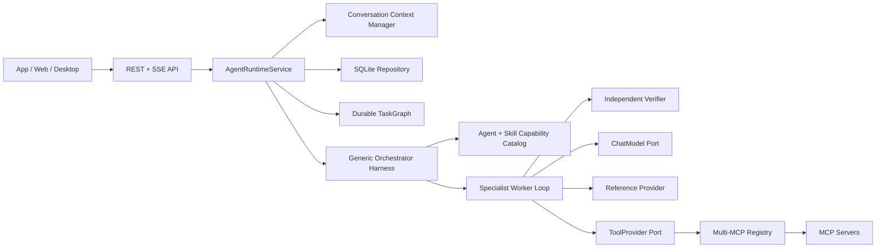

# Nino Agent

Nino Agent 是一个 API-first、多语言可演进的 Agent Harness 项目。当前可执行版本使用 Python
3.12，提供通用 Orchestrator、受控 Specialist ReAct Worker、共享 Agent/Skill 契约、多 MCP
ToolProvider、SQLite 多轮会话和 Loop Engineering。独立的 .NET MCP Server 提供演示数据能力。

当前版本：`0.13.0`。

## 当前能力

- FastAPI REST + SSE，不依赖 CLI 作为产品入口。
- 严格 Skill 白名单的 `nino.orchestrator`；确定性排除优先，关键词未命中时仅在 opt-in Skill 中执行
  受控语义 dispatch / clarification / rejection。
- lightweight 与 LangGraph 两种 Specialist ReAct Worker。
- 原生 OpenAI-compatible 与 LangChain 模型 Adapter。
- OpenAI-compatible Tool Calling 和可选 `reasoning_content` 回传。
- 多 MCP Server 发现、Tool 名称冲突检测、并发限制、熔断和必需/可选服务故障隔离。
- Agent + Skill 双重 Tool 白名单、Reference 按需加载和目录逃逸保护。
- SQLite Conversation、Message、Run、Event、上下文摘要与 Loop checkpoint。
- SQLite `TaskGraph/TaskNode/TaskGate/NodeAttempt` 控制真相和进程重启恢复。
- 分析结果必须由独立 Verifier 重新调用只读 Tool 取证，通过后 Orchestrator 才能完成。
- Orchestrator 在执行前生成带稳定 `node_id/depends_on/input_bindings` 和业务 Acceptance Contract 的
  Graph revision。
- Ready Node 按依赖波次调度；互不依赖的 Specialist Node 安全并行。
- SQLite 原子 Node claim/lease、Attempt 收口、Graph version CAS 和事件 sequence 分配。
- Runtime 心跳与失效租约恢复；正常停机记录 `run_interrupted`，下次启动继续 queued Run。
- TaskGraph lint、结构化 Node Result/Evaluator Verdict、Graph lineage 与归档时间。
- Skill manifest 分离 Workflow execution shape、Assurance mode 与 Worker 执行指令。
- Graph revision 拒绝未知依赖、重复 Node ID 和循环依赖；失败后可追加 reconcile revision。
- 基于 token 预算的溢出压缩；短会话不会重复压缩。
- Loop step/action/timeout/连续失败/无进展/重复 Action 约束。
- Docker Compose 启动 Runtime、.NET MCP 和 PostgreSQL。

当前没有实现 Web 前端、身份认证、远程共享存储和写操作审批。恢复时会重跑 Root Orchestration，
但相同稳定 Node ID 的已完成 Node 会复用持久化结果，不重新调用 Worker；不会恢复模型隐藏推理。
ACP 不属于当前产品范围，App、Web、Desktop 继续使用 REST + SSE。

## 总体架构



依赖方向：

```text
API -> Runtime -> Framework Ports
Harness -> Framework Ports
Infrastructure -> Framework Ports
Bootstrap -> 选择并组装具体 Adapter
```

Framework 不引用 FastAPI、SQLite、httpx、LangChain、LangGraph 或 MCP SDK。

## 两层 Loop

一次用户 Run 包含两个不同职责的循环。

```text
Orchestration Loop
  scope gate -> plan DAG revision -> persist -> schedule ready nodes
  -> observe gates -> reconcile revision OR finish

Worker ReAct Loop
  reason -> tool/reference action -> observation -> evidence gate -> continue/final answer
```

主模型只看到候选能力摘要和 `nino_runtime_dispatch_agent`，看不到业务 MCP Tools。选中的
Specialist 才加载完整 Skill、References 和白名单内 MCP schema。

严格边界由 Harness 执行：先应用 `excluded_intent_keywords`，再匹配 `intent_keywords`；未命中时不调用模型并产生
`policy_rejected(OUT_OF_SCOPE)`；命中后主模型不得零 dispatch 直接回答；Worker 没有成功 Tool
Observation 时只能返回不超过 500 字符且包含明确补充信息要求的澄清问题。父 Orchestrator 只有
至少一个子 Agent 成功完成后才能生成最终答案。

分析 Agent 成功并不直接计为 Orchestrator 成功。Harness 会自动创建依赖于分析 Node 的 Verification
Node，Verifier 使用相同 Skill 但独立重新查询；只有调用
`nino_runtime_submit_evaluator_verdict` 提交 `verdict=passed/evidence_level=proved`，且存在成功 Tool
Observation 时，Verification Gate 才通过。

澄清不是自由文本例外：Worker 必须调用内部结构化 Action
`nino_runtime_request_clarification`，Harness 校验后以 `clarification_requested` 事件完成。

两个 Loop 共用稳定状态：

- `kind`: `orchestration` 或 `worker_react`。
- `status`: `running/completed/failed/cancelled`。
- `step/max_steps`。
- `action_count/max_actions`。
- `successful_actions/failed_actions/consecutive_failures/no_progress_steps`。
- `elapsed_ms/timeout_seconds`。
- `last_action_hash`，不保存完整参数。
- `stop_reason/error_code`。

每次模型调用前、Observation 后和终止时产生 `loop_checkpoint`。事件写入 SQLite
`run_events`，可通过以下接口读取：

```text
GET /api/v1/runs/{run_id}/loop-checkpoint
GET /api/v1/runs/{run_id}/loop-checkpoint?kind=orchestration
GET /api/v1/runs/{run_id}/loop-checkpoint?kind=worker_react
GET /api/v1/runs/{run_id}/task-graph
GET /api/v1/runs/{run_id}/task-graph/lint
GET /api/v1/runs/{run_id}/task-graph/nodes
GET /api/v1/runs/{run_id}/task-graph/gates
GET /api/v1/runs/{run_id}/task-graph/attempts
```

Loop 详细状态机、预算和恢复边界见 [Loop Engineering 设计](./doc/loop-engineering-design.md)。

## 目录

```text
nino-agent/
├── agent/
│   ├── shared/                    # 跨语言 Agent/Skill/Reference/JSON Schema
│   ├── python/                    # 当前可执行 Agent Runtime
│   ├── nodejs/                    # 后续语言实现预留
│   └── dotnet/                    # 后续语言实现预留
├── mcp/dotnet/                    # 当前可执行 .NET MCP Server
├── database/                      # PostgreSQL migration、seed、验证 SQL
├── nino-agent-storage/            # 本地 SQLite Runtime 数据
├── doc/                           # 设计、调用链和运行手册
├── web/                           # 尚未实现
├── docker-compose.yml
└── .env.example
```

Python 内部层次：

```text
agent/python/src/
├── api/                           # REST/SSE DTO 与 transport
├── runtime/                       # Conversation/Run/context/event 生命周期
├── harness/                       # Orchestrator、Loop、ReAct、Skill/Agent policy
├── framework/                     # 稳定实体和 Ports
├── infrastructure/               # Model/MCP/SQLite Adapter
└── bootstrap.py                   # Composition Root
```

## Shared 扩展规则

`agent/shared` 是跨语言唯一事实源：

```text
shared/
├── contracts/
├── agents/
└── skills/
```

新增业务按实际能力增加：

1. Specialist Agent：角色、capabilities、Skill/Tool 权限和 Loop 预算。
2. Skill：使用场景、业务步骤、risk level、References、Tool 权限和 Loop 预算。
3. MCP Tool：真正访问外部数据或系统。
4. 测试：能力路由、权限拒绝、Tool 结果和事件链。

主 Orchestrator 不追加业务名称。Runtime 根据新 Agent + Skill 自动生成 Capability Catalog。

Skill 通过 `assurance.required_evaluators` 声明验收角色，而不是把 Verifier 写死在 Runtime：

```json
{
  "assurance": {
    "required_evaluators": ["verification"]
  }
}
```

可选值为 `verification`、`review`、`critique`。对应 Specialist Agent 必须声明可匹配的 capability；
Bootstrap 会在服务启动前拒绝缺失的验收角色。

Loop 配置示例：

```json
{
  "max_steps": 5,
  "loop": {
    "max_actions": 6,
    "timeout_seconds": 60,
    "max_consecutive_failures": 2,
    "max_no_progress_steps": 2
  }
}
```

Worker 使用 Agent 与 Skill 两层中更严格的值，任何业务配置都不能放宽 Runtime 硬限制。
Runtime 硬限制由 `NINO_LOOP_HARD_MAX_STEPS`、`NINO_LOOP_HARD_MAX_ACTIONS`、
`NINO_LOOP_HARD_TIMEOUT_SECONDS`、`NINO_LOOP_HARD_MAX_CONSECUTIVE_FAILURES` 和
`NINO_LOOP_HARD_MAX_NO_PROGRESS_STEPS` 配置。

## 启动 Demo

```bash
cd /Users/wangzewei/Documents/Code/github/luck/AiAgent/newagent-vv/nino-agent
docker compose up -d --build
docker compose ps
curl -s http://127.0.0.1:8090/health
```

接口：

- Runtime：`http://127.0.0.1:8090`
- Swagger：`http://127.0.0.1:8090/docs`
- MCP：`http://127.0.0.1:8091/mcp`
- PostgreSQL：`localhost:55432`

Demo 模式不调用真实模型或 MCP，适合验证 API、路由、Loop、持久化和事件。

## gpt-5.4 Live

Runtime 在代码中固定使用 `gpt-5.4`，不读取模型名称环境变量。本地启动前，让 Runtime 进程从
系统环境读取以下配置：

```bash
export OPENAI_API_KEY='<your-key>'
export INCERRY_OPENAI_BASE_URL='http://core.dns-pro.net:13001/v1'
export NINO_RUNTIME_MODE=live
export NINO_AGENT_ENGINE=lightweight
export NINO_MODEL_ADAPTER=native
```

`OPENAI_API_KEY` 不能写入 Skill、README、Dockerfile、`.env` 或版本库。完整启动和 ReAct Tool
Calling 验收见 [gpt-5.4 启动手册](./doc/gpt-5.4-agent-runbook.md)。

## 测试

```bash
cd agent/python
.venv/bin/python -m unittest discover -s tests -v
.venv/bin/python -m compileall -q src tests
```

真实模型、Skill、MCP 和 Loop Engineering 基准：

```bash
cd agent/python
.venv/bin/python evals/live_benchmark.py \
  --tag smoke \
  --output ../../nino-agent-storage/live-benchmark.json
```

题集、评分维度和单题执行方式见 [Live Agent Benchmark](./agent/python/evals/README.md)。
标准题库蒸馏、版本和多语言复用规范见
[Skill 标准题库设计](./doc/skill-question-bank-design.md)。

验收不仅检查最终文本，还必须检查：

```text
orchestration loop checkpoint
-> nino_runtime_dispatch_agent
-> agent_started + selected Skill
-> worker loop checkpoint
-> reference/MCP tool_started + tool_completed
-> agent_completed
-> orchestration final checkpoint
-> run_completed
```

## 权威文档

- [Loop Engineering 设计](./doc/loop-engineering-design.md)
- [通用 Orchestrator 设计](./doc/generic-orchestrator-design.md)
- [Runtime 调用链与多 MCP](./doc/agent-runtime-call-chain.md)
- [Python Runtime API](./doc/python-agent-runtime-api.md)
- [多语言分层规范](./doc/multi-language-agent-architecture.md)
- [Skill 标准题库设计](./doc/skill-question-bank-design.md)
- [gpt-5.4 启动与验收](./doc/gpt-5.4-agent-runbook.md)
