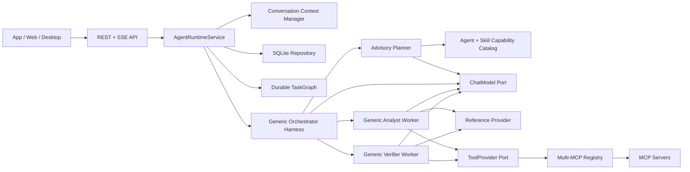

# Nino Agent

Nino Agent 是一个 API-first、多语言可演进的任务级 Agent Harness 项目。它使用语言无关的共享契约
描述 Agent、Skill、TaskGraph 和执行边界，再由不同语言实现 Runtime 与基础设施 Adapter。当前唯一
可执行的 Agent Runtime 使用 Python 3.12；独立的 .NET MCP Server 提供演示数据能力。

当前版本：`0.14.0`。

当前最准确的产品定位是：

> 一个支持持久化任务图、确定性证据门禁、独立验证和故障恢复的只读数据分析 Harness。

完整的设计动机、代码映射、执行流程、恢复边界和 Git 演进见
[任务级 Harness 完整设计](./doc/task-level-harness-design.md)。

## 多语言实现状态

| Component | Status | Responsibility |
|---|---|---|
| `agent/shared` | 已实现 | 跨语言 Agent、Skill、Reference、TaskGraph 和 JSON Schema 契约，是能力定义的唯一事实源 |
| `agent/python` | 已实现 | 当前唯一可执行 Agent Runtime，承载 REST/SSE、Harness、TaskGraph、Worker 和 SQLite Adapter |
| `mcp/dotnet` | 已实现 | 独立的数据访问 MCP Server，不是 .NET Agent Runtime |
| `agent/dotnet` | 预留 | 未来可基于共享契约实现 .NET Agent Runtime |
| `agent/nodejs` | 预留 | 未来可基于共享契约实现 Node.js Agent Runtime |
| `web` | 未实现 | 未来客户端入口；当前 App、Web、Desktop 均通过 REST + SSE 接入 |

多语言指的是核心领域契约和行为可以由多种语言实现，不表示当前已经存在多个等价 Runtime。新的语言
实现必须遵守共享 Schema、状态转换、Gate、事件和 Tool 权限语义，而不是仅复刻 HTTP 接口。

## 当前 Python Runtime 能力

- FastAPI REST + SSE，不依赖 CLI 作为产品入口。
- 四个业务中立标准 Agent：`nino.orchestrator`、`nino.planner`、`nino.analyst`、
  `nino.verifier`。新增只读分析业务通常只添加 Skill、Reference 和 MCP，不新增 Agent。
- lightweight 与 LangGraph 两种通用 Analyst/Verifier ReAct Worker 实现。
- 原生 OpenAI-compatible 与 LangChain 模型 Adapter。
- OpenAI-compatible Tool Calling 和可选 `reasoning_content` 回传。
- 多 MCP Server 发现、Tool 名称冲突检测、并发限制、熔断和必需/可选服务故障隔离。
- Skill Tool 白名单与 Agent 风险/能力策略取交集、Reference 按需加载和目录逃逸保护。
- SQLite Conversation、Message、Run、Event、上下文摘要与 Loop checkpoint。
- SQLite `TaskGraph/TaskNode/TaskGate/NodeAttempt` 控制真相和进程重启恢复。
- 分析结果必须由独立 Verifier 重新调用只读 Tool 取证，通过后 Orchestrator 才能完成。
- Planner 只生成候选 Graph revision；Orchestrator 确定性校验后才接受、持久化和调度。
- Ready Node 按依赖波次调度；互不依赖的 Specialist Node 安全并行。
- SQLite 原子 Node claim/lease、Attempt 收口、Graph version CAS 和事件 sequence 分配。
- Runtime 心跳与失效租约恢复；正常停机记录 `run_interrupted`，下次启动继续 queued Run。
- TaskGraph lint、结构化 Node Result/Evaluator Verdict、Graph lineage 与归档时间。
- Skill manifest 分离 Workflow execution shape、Assurance mode 与 Worker 执行指令。
- Graph revision 拒绝未知依赖、重复 Node ID 和循环依赖；失败后可追加 reconcile revision。
- 基于 token 预算的溢出压缩；短会话不会重复压缩。
- Loop step/action/timeout/连续失败/无进展/重复 Action 约束。
- Docker Compose 启动 Runtime、.NET MCP 和本地标准 PostgreSQL 12.18；确定性数据集包含 25,040
  个订单和超过 10 万条关联记录。

当前没有实现 Web 前端、身份认证、远程共享存储和写操作审批。恢复时会重跑 Root Orchestration，
但相同稳定 Node ID 的已完成 Node 会复用持久化结果，不重新调用 Worker；不会恢复模型隐藏推理。
ACP 不属于当前产品范围，App、Web、Desktop 继续使用 REST + SSE。

## 总体架构



依赖方向：

```text
API -> Runtime -> Framework Ports
Harness -> Framework Ports
Infrastructure -> Framework Ports
Bootstrap -> 选择并组装具体 Adapter
```

Framework 不引用 FastAPI、SQLite、httpx、LangChain、LangGraph 或 MCP SDK。

## 两层 Loop

一次用户 Run 包含两个不同职责的循环。

```text
Orchestration Loop
  scope gate -> ask Planner -> validate candidate DAG -> persist -> schedule ready nodes
  -> observe gates -> reconcile revision OR finish

Worker ReAct Loop
  reason -> tool/reference action -> observation -> evidence gate -> continue/final answer
```

Planner 只看到用户目标、会话历史、候选能力摘要、紧凑 Node outcome 和
`nino_runtime_submit_task_graph_node`，看不到业务 Skill 正文或 MCP Tools；
Orchestrator 不接收规划 Action，只接收已验证 Node 结果并生成最终回答。选中的 Analyst/Verifier
才加载完整 Skill、References 和白名单内 MCP schema。

严格边界由 Harness 执行：先应用 `excluded_intent_keywords`，再匹配 `intent_keywords`。关键词命中
时直接约束候选目录；未命中时，只有声明 `semantic_fallback=true` 的 Skill 可以进入模型辅助路由。
Planner 必须通过结构化 Action 提交候选节点、澄清或拒绝；Orchestrator 对候选图执行确定性校验，
并且只有已验证工作成功后才能回答。Worker 没有成功 Tool Observation 时不能输出事实性结论。
Planner proposal 不单独持久化为 TaskNode；只有 Orchestrator 接受后，才投影为 Specialist 和所需
Evaluator Node。持久化图中保留 `orchestration/specialist/verification` 等执行节点。

分析 Agent 成功并不直接计为 Orchestrator 成功。Harness 会自动创建依赖于分析 Node 的 Verification
Node，Verifier 使用相同 Skill 但独立重新查询；只有调用
`nino_runtime_submit_evaluator_verdict` 提交 `verdict=passed/evidence_level=proved`，且存在成功 Tool
Observation 时，Verification Gate 才通过。

澄清不是自由文本例外：Worker 必须调用内部结构化 Action
`nino_runtime_request_clarification`，Harness 校验后以 `clarification_requested` 事件完成。

两个 Loop 共用稳定状态：

- `kind`: `orchestration` 或 `worker_react`。
- `status`: `running/completed/failed/cancelled`。
- `step/max_steps`。
- `action_count/max_actions`。
- `successful_actions/failed_actions/consecutive_failures/no_progress_steps`。
- `elapsed_ms/timeout_seconds`。
- `last_action_hash`，不保存完整参数。
- `stop_reason/error_code`。

每次模型调用前、Observation 后和终止时产生 `loop_checkpoint`。事件写入 SQLite
`run_events`，可通过以下接口读取：

```text
GET /api/v1/runs/{run_id}/loop-checkpoint
GET /api/v1/runs/{run_id}/loop-checkpoint?kind=orchestration
GET /api/v1/runs/{run_id}/loop-checkpoint?kind=worker_react
GET /api/v1/runs/{run_id}/task-graph
GET /api/v1/runs/{run_id}/task-graph/lint
GET /api/v1/runs/{run_id}/task-graph/nodes
GET /api/v1/runs/{run_id}/task-graph/gates
GET /api/v1/runs/{run_id}/task-graph/attempts
```

Loop 状态机、预算、TaskGraph、Gate、Verifier 与恢复语义统一见
[任务级 Harness 完整设计](./doc/task-level-harness-design.md)。

## 目录

```text
nino-agent/
├── agent/
│   ├── shared/                    # 跨语言 Agent/Skill/Reference/JSON Schema
│   ├── python/                    # 当前可执行 Agent Runtime
│   ├── nodejs/                    # 后续语言实现预留
│   └── dotnet/                    # 后续语言实现预留
├── mcp/dotnet/                    # 当前可执行 .NET MCP Server
├── database/                      # PostgreSQL migration、seed、验证 SQL
├── nino-agent-storage/            # 本地 SQLite Runtime 数据
├── doc/                           # 设计、调用链和运行手册
├── web/                           # 尚未实现
├── docker-compose.yml
└── .env.example
```

当前 Python Runtime 内部层次：

```text
agent/python/src/
├── api/                           # REST/SSE DTO 与 transport
├── runtime/                       # Conversation/Run/context/event 生命周期
├── harness/                       # Orchestrator、Loop、ReAct、Skill/Agent policy
├── framework/                     # 稳定实体和 Ports
├── infrastructure/               # Model/MCP/SQLite Adapter
└── bootstrap.py                   # Composition Root
```

## Shared 扩展规则

`agent/shared` 是跨语言能力定义的唯一事实源：

```text
shared/
├── contracts/
├── agents/
├── skills/
└── question-banks/
```

兼容的只读分析业务默认只增加：

1. Skill：使用场景、业务步骤、risk level、References、Tool 权限、Workflow/Assurance 和 Loop 预算。
2. MCP Server/Tool：真正访问外部数据或系统。
3. 固定题库：路由、边界、Golden facts 和期望证据。
4. 测试：Skill 兼容性、权限拒绝、Tool 结果、Planner proposal、Gate 和事件链。

四个标准 Agent 不追加业务名称。`nino.analyst` 与 `nino.verifier` 通过
`accepted_risk_levels/accepted_capabilities/tool_policy` 匹配新 Skill；当前
`selected-skill-only + read-only` 表示 Tool 权限来自“已发现 MCP Tool、Skill allowlist 和 Agent
角色策略”的交集。只有新业务超出通用只读分析职责或需要新的评价类型时，才新增 Agent。

Skill 通过 `assurance.required_evaluators` 声明验收角色，而不是把 Verifier 写死在 Runtime：

```json
{
  "assurance": {
    "required_evaluators": ["verification"]
  }
}
```

可选值为 `verification`、`review`、`critique`。对应 Evaluator Agent 必须与 Skill 风险和能力策略兼容；
Bootstrap 会在服务启动前拒绝缺失的验收角色。

Loop 配置示例：

```json
{
  "max_steps": 5,
  "loop": {
    "max_actions": 6,
    "timeout_seconds": 60,
    "max_consecutive_failures": 2,
    "max_no_progress_steps": 2
  }
}
```

Worker 使用 Agent 与 Skill 两层中更严格的值，任何业务配置都不能放宽 Runtime 硬限制。
Runtime 硬限制由 `NINO_LOOP_HARD_MAX_STEPS`、`NINO_LOOP_HARD_MAX_ACTIONS`、
`NINO_LOOP_HARD_TIMEOUT_SECONDS`、`NINO_LOOP_HARD_MAX_CONSECUTIVE_FAILURES` 和
`NINO_LOOP_HARD_MAX_NO_PROGRESS_STEPS` 配置。

## 启动 Docker Live

Docker 中的 Agent Runtime 固定使用 `live + lightweight + native`，不会回退到 `demo`。启动前在
宿主终端导出模型环境变量；Compose 只将变量注入容器，不把密钥写入镜像或仓库：

```bash
cd /Users/wangzewei/Documents/Code/github/luck/AiAgent/newagent-vv/nino-agent
export OPENAI_API_KEY='<your-key>'
export INCERRY_OPENAI_BASE_URL='http://core.dns-pro.net:13001/v1'
docker compose up -d --build
docker compose ps
curl -s http://127.0.0.1:8090/health
```

接口：

- Runtime：`http://127.0.0.1:8090`
- Swagger：`http://127.0.0.1:8090/docs`
- MCP：`http://127.0.0.1:8091/mcp`
- PostgreSQL：`localhost:55432`

需要无模型成本的确定性验证时，直接运行 Python 单元测试；Docker 服务用于真实模型与 MCP 链路。

## gpt-5.4 Live

Runtime 在代码中固定使用 `gpt-5.4`，不读取模型名称环境变量。本地启动前，让 Runtime 进程从
系统环境读取以下配置：

```bash
export OPENAI_API_KEY='<your-key>'
export INCERRY_OPENAI_BASE_URL='http://core.dns-pro.net:13001/v1'
export NINO_RUNTIME_MODE=live
export NINO_AGENT_ENGINE=lightweight
export NINO_MODEL_ADAPTER=native
```

`OPENAI_API_KEY` 不能写入 Skill、README、Dockerfile、`.env` 或版本库。完整启动和 ReAct Tool
Calling 验收见 [gpt-5.4 启动手册](./doc/gpt-5.4-agent-runbook.md)。

## 测试

```bash
cd agent/python
.venv/bin/python -m unittest discover -s tests -v
.venv/bin/python -m compileall -q src tests
```

真实模型、Skill、MCP 和 Loop Engineering 基准：

```bash
cd agent/python
.venv/bin/python evals/live_benchmark.py \
  --tag smoke \
  --output ../../nino-agent-storage/live-benchmark.json
```

题集、评分维度和单题执行方式见 [Live Agent Benchmark](./agent/python/evals/README.md)。固定标准题库位于
`agent/shared/question-banks/`，由所有语言实现共享；总体测试策略见
[任务级 Harness 完整设计](./doc/task-level-harness-design.md#21-测试策略和证据)。

验收不仅检查最终文本，还必须检查：

```text
planning model_started (nino.planner)
-> candidate nino_runtime_submit_task_graph_node
-> graph_planned / graph_reconciled
-> agent_started (nino.analyst) + selected Skill
-> worker loop checkpoint
-> reference/MCP tool_started + tool_completed
-> agent_completed (nino.analyst)
-> agent_started/completed (nino.verifier)
-> evidence + independent_verification gates passed
-> reconciliation model_started (nino.orchestrator, no tools)
-> orchestration final checkpoint
-> run_completed
```

## 权威文档

- [任务级 Harness 完整设计](./doc/task-level-harness-design.md)
- [Python Runtime README](./agent/python/README.md)
- [gpt-5.4 启动与验收](./doc/gpt-5.4-agent-runbook.md)
