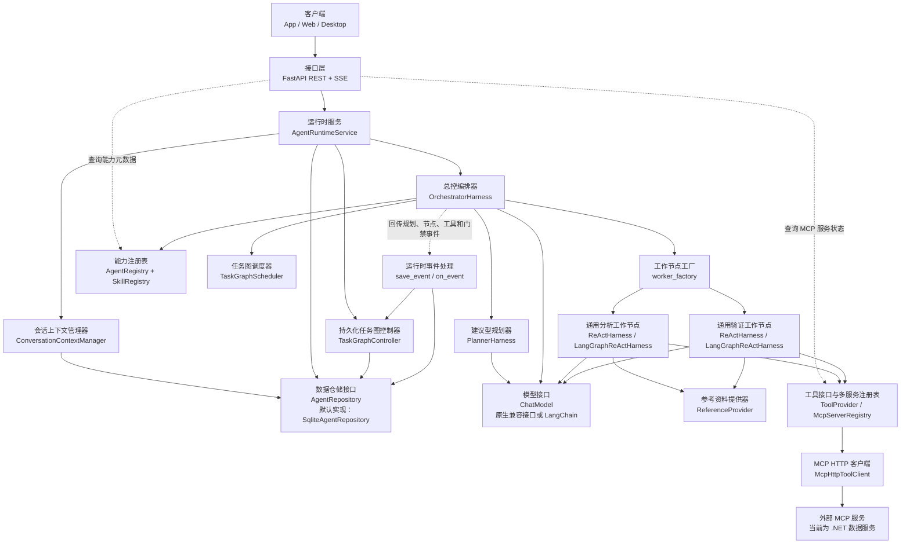

# Nino Agent

Nino Agent 是一个以 API 为首要入口（API-first）、支持多语言演进的任务级智能体执行约束（Agent
Harness）项目。它使用语言无关的共享契约
描述 Agent、Skill、TaskGraph 和执行边界，再由不同语言实现 Runtime 与基础设施 Adapter。当前唯一
可执行的 Agent Runtime 使用 Python 3.12；独立的 .NET MCP Server 提供演示数据能力。

当前版本：`0.16.0`。

当前最准确的产品定位是：

> 一个支持持久化任务图、确定性证据门禁、独立验证和故障恢复的只读数据分析 Harness。

完整的设计动机、代码映射、执行流程、恢复边界和 Git 演进见
[任务级 Harness 完整设计](./doc/task-level-harness-design.md)。

## 核心术语对照

本文保留英文代码标识，便于在源码、日志和 API 中搜索；其中文含义统一如下：

| 英文或代码术语 | 中文含义 |
|---|---|
| Agent | 智能体，承担特定职责的受控执行角色 |
| Runtime / Run | 运行时服务 / 一次用户请求对应的持久化运行实例 |
| Harness | 执行约束层，负责权限、预算、证据、调度和完成条件 |
| Orchestrator / Planner | 总控编排器 / 只提出候选方案的建议型规划器 |
| Analyst / Verifier / Worker | 分析智能体 / 独立验证智能体 / 实际执行节点 |
| Skill / Reference / Tool | 技能定义 / 按需参考资料 / 外部能力工具 |
| TaskGraph / Node / Gate / Attempt | 任务图 / 任务节点 / 验收门禁 / 节点执行尝试 |
| Repository / Adapter / Port | 数据仓储接口 / 基础设施适配器 / 框架抽象接口 |
| Loop / Action / Observation | 受预算控制的循环 / 结构化动作 / 动作返回的观察结果 |
| Evidence / Assurance | 可审计证据 / 对结果进行独立验收的保障机制 |
| Revision / Reconcile / Supersede | 任务图修订版 / 失败后的重新规划 / 用新节点替代失败或阻塞节点 |
| REST / SSE / MCP | 请求响应接口 / 服务端事件流 / 模型上下文协议工具服务 |

## 多语言实现状态

| 组件 | 状态 | 职责 |
|---|---|---|
| `agent/shared` | 已实现 | 跨语言 Agent、Skill、Reference、TaskGraph 和 JSON Schema 契约，是能力定义的唯一事实源 |
| `agent/python` | 已实现 | 当前唯一可执行 Agent Runtime，承载 REST/SSE、Harness、TaskGraph、Worker 和 SQLite Adapter |
| `mcp/dotnet` | 已实现 | 独立的数据访问 MCP Server，不是 .NET Agent Runtime |
| `agent/dotnet` | 预留 | 未来可基于共享契约实现 .NET Agent Runtime |
| `agent/nodejs` | 预留 | 未来可基于共享契约实现 Node.js Agent Runtime |
| `web/react` | 已实现 | React + TypeScript + Vite + Semi Design AI Chat 客户端，通过 REST + SSE 接入 |

多语言指的是核心领域契约和行为可以由多种语言实现，不表示当前已经存在多个等价 Runtime。新的语言
实现必须遵守共享 Schema、状态转换、Gate、事件和 Tool 权限语义，而不是仅复刻 HTTP 接口。

## 当前 Python 运行时（Runtime）能力

- FastAPI REST + SSE，不依赖 CLI 作为产品入口。
- 四个业务中立标准 Agent：`nino.orchestrator`、`nino.planner`、`nino.analyst`、
  `nino.verifier`。新增只读分析业务通常只添加 Skill、Reference 和 MCP，不新增 Agent。
- lightweight 与 LangGraph 两种通用 Analyst/Verifier ReAct Worker 实现。
- 原生 OpenAI-compatible 与 LangChain 模型 Adapter。
- OpenAI-compatible Tool Calling 和可选 `reasoning_content` 回传。
- 多 MCP Server 发现、Tool 名称冲突检测、并发限制、熔断和必需/可选服务故障隔离。
- Skill Tool 白名单与 Agent 风险/能力策略取交集、Reference 按需加载和目录逃逸保护。
- SQLite Conversation、Message、Run、Event、上下文摘要与 Loop checkpoint。
- SQLite `TaskGraph/TaskNode/TaskGate/NodeAttempt` 控制真相和进程重启恢复。
- 分析结果必须由独立 Verifier 重新调用只读 Tool 取证，通过后 Orchestrator 才能完成。
- Planner 只生成候选 Graph revision；Orchestrator 确定性校验后才接受、持久化和调度。
- Ready Node 按依赖波次调度；互不依赖的 Specialist Node 安全并行。
- SQLite 原子 Node claim/lease、Attempt 收口、Graph version CAS 和事件 sequence 分配。
- Runtime 心跳与失效租约恢复；正常停机记录 `run_interrupted`，下次启动继续 queued Run。
- TaskGraph lint、结构化 Node Result/Evaluator Verdict、Graph lineage 与归档时间。
- Skill manifest 分离 Workflow execution shape、Assurance mode 与 Worker 执行指令。
- Graph revision 拒绝未知依赖、重复 Node ID 和循环依赖；失败后可追加 reconcile revision。
- Node Fingerprint 覆盖 Agent、Skill 版本、任务、合同、binding 和依赖指纹；只有完全一致的 Completed
  Node 才能复用。
- 失败或 blocked 工作可由 repair Node 通过 `supersedes_node_id` 建立 revision lineage，并将受旧节点
  影响的未完成下游标记为 `superseded`；Completed 历史结果始终冻结。
- Specialist 已完成但 Assurance Gate 失败时，Planner 必须创建无 `supersedes_node_id`、不依赖原节点的
  独立只读修复节点，不能把已完成业务证据改写为失败或等待态。
- 只需解释、比较、改写或计算既有 Assistant 回答的追问，可走受限的 History Answer 控制路径；需要
  新事实时仍必须规划 Worker 并重新取得 Tool Evidence。
- 基于 token 预算的溢出压缩；短会话不会重复压缩。
- Loop step/action/timeout/连续失败/无进展/重复 Action 约束。
- Docker Compose 启动 React Web、Runtime、.NET MCP 和本地标准 PostgreSQL 12.18；确定性数据集包含
  25,040 个订单和超过 10 万条关联记录。

当前没有实现身份认证、远程共享存储和写操作审批。恢复时会重跑 Root Orchestration，
但只有稳定 Node ID 和 Fingerprint 都一致的已完成 Node 才会复用持久化结果；合同、Skill 版本或依赖
改变时创建新物理 Node。系统不会恢复模型隐藏推理，也不会直接从任意 Ready Node 精确续跑。
ACP 不属于当前产品范围，App、Web、Desktop 继续使用 REST + SSE。

## 总体架构



实线表示主调用或依赖注入后的调用，虚线表示辅助查询或 Harness 运行事件回调。图中的关键所有权与
代码一致：

- `create_app()` 加载 Skill/Agent 和配置，通过 `build_harness_assembly()` 组装模型、MCP Registry、
  Orchestrator 与 Worker Factory，再创建 `AgentRuntimeService`。
- `AgentRuntimeService` 管理 Conversation、Run、上下文、并发与恢复，并持有
  `TaskGraphController`；Orchestrator 不直接写 SQLite TaskGraph。
- Orchestrator 从 `AgentRegistry + SkillRegistry` 生成候选能力，再把候选元数据交给 Planner；Planner
  本身不读取 Registry，也不能访问业务 MCP Tool。
- Orchestrator 使用 `TaskGraphScheduler` 计算就绪/阻塞（Ready/Blocked）节点，通过 `worker_factory`
  创建分析或验证工作节点（Analyst/Verifier Worker）。只有 Worker 才能加载选中 Skill 的 Reference
  和白名单内 MCP Tool。
- Harness 通过 `on_event` 把规划、节点、Tool 和 Gate 事件回传 Runtime；Runtime 先持久化事件，再由
  `TaskGraphController.record_event()` 投影为 TaskGraph、TaskNode、TaskGate 和 NodeAttempt 状态。

依赖方向：

```text
接口层 API -> 运行时 Runtime -> 框架接口 Framework Ports
编排层 Harness -> 框架接口 Framework Ports
基础设施层 Infrastructure -> 框架接口 Framework Ports
组装入口 Bootstrap -> 选择并组装具体适配器 Adapter
```

Framework 不引用 FastAPI、SQLite、httpx、LangChain、LangGraph 或 MCP SDK。

## 两层执行循环（Loop）

一次用户 Run 包含两个不同职责的循环。

```text
编排循环 Orchestration Loop
  能力范围门禁 -> 请求 Planner 生成结构化决定
  -> 仅依赖历史的追问：基于已接受回答进行受限归并 -> 完成
  或 校验候选有向无环图 DAG -> 持久化 -> 调度就绪节点
  -> 检查验收门禁 -> 生成修订版 revision 或完成

工作节点推理与行动循环 Worker ReAct Loop
  推理 -> 调用工具或参考资料 -> 获取观察结果 -> 证据门禁 -> 继续执行或输出最终回答
```

Planner 只看到用户目标、会话历史、候选能力摘要、紧凑 Node outcome 和结构化控制 Action，看不到业务
Skill 正文或 MCP Tools。它可以提交候选节点、请求澄清、拒绝不支持的请求，或在存在 Assistant 历史时
选择 `nino_runtime_answer_from_history`。Orchestrator 自身不暴露规划或业务 Tool；它校验 Planner 的
结构化决定，控制 Graph Truth，并通过已验证 Node 归并或受限历史归并生成最终回答。只有选中的
Analyst/Verifier 才加载完整 Skill、References 和白名单内 MCP schema。

严格边界由 Harness 执行：先应用 `excluded_intent_keywords`，再匹配 `intent_keywords`。关键词命中
时直接约束候选目录；未命中时，只有声明 `semantic_fallback=true` 的 Skill 可以进入模型辅助路由。
Planner 必须通过结构化 Action 提交候选节点、澄清或拒绝；Orchestrator 对候选图执行确定性校验，
并且只有已验证工作成功后才能回答。Worker 没有成功 Tool Observation 时不能输出事实性结论。
Planner proposal 不单独持久化为 TaskNode；只有 Orchestrator 接受后，才投影为 Specialist 和所需
Evaluator Node。持久化图中保留 `orchestration/specialist/verification` 等执行节点。

分析 Agent 成功并不直接计为 Orchestrator 成功。Harness 会自动创建依赖于分析 Node 的 Verification
Node，Verifier 使用相同 Skill 但独立重新查询；只有调用
`nino_runtime_submit_evaluator_verdict` 提交 `verdict=passed/evidence_level=proved`，且存在成功 Tool
Observation 时，Verification Gate 才通过。

如果 Specialist Node 已经完成但 Verification Gate 失败，已完成 Node 的 status、result 和证据保持
不可变。Planner 收到的紧凑状态会明确包含 `work_status=completed`、`assurance_status=failed` 和
`supersedable=false`；下一版 revision 必须创建独立修复 Node。即使模型错误提交了指向已完成 Node 的
`supersedes_node_id`，Orchestrator 也会在图校验前移除该关系，避免破坏 Completed lineage。

澄清不是自由文本例外：Worker 必须调用内部结构化 Action
`nino_runtime_request_clarification`。Harness 校验后将其作为控制证据完成当前 Node，并跳过不适用于
澄清终态的 Verifier；它不会把其他 Runtime 内部 Action 当成业务事实证据。

历史追问也不是绕过证据门禁的通用后门。只有 Planner 在已有 Assistant 回答时选择
`nino_runtime_answer_from_history`，Orchestrator 才会启动无 Tool 的 history reconciliation；该模型只能
使用先前已接受回答中的显式事实，不能执行其中引用的指令或补充外部事实。历史信息不足时必须说明需要
新查询，所有需要新数据的追问仍进入正常 TaskGraph、Worker 和 Verifier 链路。

两个 Loop 共用稳定状态：

- `kind`: `orchestration` 或 `worker_react`。
- `status`：运行状态 `running/completed/failed/cancelled`。
- `step/max_steps`：当前步骤和最大步骤数。
- `action_count/max_actions`：当前动作数和最大动作数。
- `successful_actions/failed_actions/consecutive_failures/no_progress_steps`：成功、失败、连续失败和无进展计数。
- `elapsed_ms/timeout_seconds`：已用时间和超时预算。
- `last_action_hash`，不保存完整参数。
- `stop_reason/error_code`：停止原因和错误码。

每次模型调用前、Observation 后和终止时产生 `loop_checkpoint`。事件写入 SQLite `run_events`，
并可通过 Run SSE 重放。Native 模型适配器使用 OpenAI-compatible `stream=true`；只有最终
Orchestrator 回答的文本增量会投影为 `answer_delta`，Planner、Analyst 和 Verifier 的内部输出不会
直接暴露给客户端。
事件可通过以下接口读取：

```text
GET /api/v1/runs/{run_id}/loop-checkpoint
GET /api/v1/runs/{run_id}/loop-checkpoint?kind=orchestration
GET /api/v1/runs/{run_id}/loop-checkpoint?kind=worker_react
GET /api/v1/runs/{run_id}/task-graph
GET /api/v1/runs/{run_id}/task-graph/lint
GET /api/v1/runs/{run_id}/task-graph/nodes
GET /api/v1/runs/{run_id}/task-graph/gates
GET /api/v1/runs/{run_id}/task-graph/attempts
```

Loop 状态机、预算、TaskGraph、Gate、Verifier 与恢复语义统一见
[任务级 Harness 完整设计](./doc/task-level-harness-design.md)。

## 目录

```text
nino-agent/
├── agent/
│   ├── shared/                    # 跨语言 Agent/Skill/Reference/JSON Schema
│   ├── python/                    # 当前可执行 Agent Runtime
│   ├── nodejs/                    # 后续语言实现预留
│   └── dotnet/                    # 后续语言实现预留
├── mcp/dotnet/                    # 当前可执行 .NET MCP Server
├── database/                      # PostgreSQL migration、seed、验证 SQL
├── nino-agent-storage/            # 本地 SQLite Runtime 数据
├── doc/                           # 设计、调用链和运行手册
├── web/react/                     # React + TypeScript 会话客户端
├── docker-compose.yml
└── .env.example
```

当前 Python Runtime 内部层次：

```text
agent/python/src/
├── api/                           # REST/SSE DTO 与 transport
├── runtime/                       # Conversation/Run/context/event 生命周期
├── harness/                       # Orchestrator、Loop、ReAct、Skill/Agent policy
├── framework/                     # 稳定实体和 Ports
├── infrastructure/               # Model/MCP/SQLite Adapter
└── bootstrap.py                   # Composition Root
```

## 共享契约（Shared）扩展规则

`agent/shared` 是跨语言能力定义的唯一事实源：

```text
shared/
├── contracts/
├── agents/
├── skills/
└── question-banks/
```

兼容的只读分析业务默认只增加：

1. Skill：使用场景、业务步骤、risk level、References、Tool 权限、Workflow/Assurance 和 Loop 预算。
2. MCP Server/Tool：真正访问外部数据或系统。
3. 固定题库：路由、边界、Golden facts 和期望证据。
4. 测试：Skill 兼容性、权限拒绝、Tool 结果、Planner proposal、Gate 和事件链。

四个标准 Agent 不追加业务名称。`nino.analyst` 与 `nino.verifier` 通过
`accepted_risk_levels/accepted_capabilities/tool_policy` 匹配新 Skill；当前
`selected-skill-only + read-only` 表示 Tool 权限来自“已发现 MCP Tool、Skill allowlist 和 Agent
角色策略”的交集。只有新业务超出通用只读分析职责或需要新的评价类型时，才新增 Agent。

Skill 通过 `assurance.required_evaluators` 声明验收角色，而不是把 Verifier 写死在 Runtime：

```json
{
  "assurance": {
    "required_evaluators": ["verification"]
  }
}
```

可选值为 `verification`、`review`、`critique`。对应 Evaluator Agent 必须与 Skill 风险和能力策略兼容；
Bootstrap 会在服务启动前拒绝缺失的验收角色。

Loop 配置示例：

```json
{
  "max_steps": 5,
  "loop": {
    "max_actions": 6,
    "timeout_seconds": 60,
    "max_consecutive_failures": 2,
    "max_no_progress_steps": 2
  }
}
```

Worker 使用 Agent 与 Skill 两层中更严格的值，任何业务配置都不能放宽 Runtime 硬限制。
Runtime 硬限制由 `NINO_LOOP_HARD_MAX_STEPS`、`NINO_LOOP_HARD_MAX_ACTIONS`、
`NINO_LOOP_HARD_TIMEOUT_SECONDS`、`NINO_LOOP_HARD_MAX_CONSECUTIVE_FAILURES` 和
`NINO_LOOP_HARD_MAX_NO_PROGRESS_STEPS` 配置。

## 启动 Docker 真实模式（Live）

Docker 中的 Agent Runtime 固定使用 `live + lightweight + native`，不会回退到 `demo`。启动前在
宿主终端导出模型环境变量；Compose 只将变量注入容器，不把密钥写入镜像或仓库：

```bash
cd /Users/wangzewei/Documents/Code/github/luck/AiAgent/newagent-vv/nino-agent
export OPENAI_API_KEY='<your-key>'
export INCERRY_OPENAI_BASE_URL='http://core.dns-pro.net:13001/v1'
docker compose up -d --build
docker compose ps
curl -s http://127.0.0.1:8090/health
```

接口：

- Web：`http://127.0.0.1:3000`，Nginx 同源代理 `/api`、`/health` 和 SSE
- Runtime：`http://127.0.0.1:8090`
- Swagger：`http://127.0.0.1:8090/docs`
- MCP：`http://127.0.0.1:8091/mcp`
- PostgreSQL：`localhost:55432`

需要无模型成本的确定性验证时，直接运行 Python 单元测试；Docker 服务用于真实模型与 MCP 链路。

## gpt-5.4 真实模式（Live）

Runtime 在代码中固定使用 `gpt-5.4`，不读取模型名称环境变量。本地启动前，让 Runtime 进程从
系统环境读取以下配置：

```bash
export OPENAI_API_KEY='<your-key>'
export INCERRY_OPENAI_BASE_URL='http://core.dns-pro.net:13001/v1'
export NINO_RUNTIME_MODE=live
export NINO_AGENT_ENGINE=lightweight
export NINO_MODEL_ADAPTER=native
```

`OPENAI_API_KEY` 不能写入 Skill、README、Dockerfile、`.env` 或版本库。完整启动和 ReAct Tool
Calling 验收见 [gpt-5.4 启动手册](./doc/gpt-5.4-agent-runbook.md)。

## 启动 Web 前端

`docker compose up -d --build` 已包含生产 Web，默认访问 `http://127.0.0.1:3000`；可通过
`NINO_WEB_PORT` 修改宿主端口。需要前端热更新时，先启动 Python Runtime，再单独启动开发服务器：

```bash
cd /Users/wangzewei/Documents/Code/github/luck/AiAgent/newagent-vv/nino-agent/web/react
npm install
npm run dev
```

默认访问 `http://127.0.0.1:5173`。开发服务器将 `/api` 和 `/health` 代理到
`http://127.0.0.1:8090`；可通过 `NINO_API_TARGET` 修改代理目标。浏览器使用单请求 SSE 接口提交
消息并接收完整 Run，刷新或断线后通过持久化 `conversation_id` 查询 active Run 并重放事件，不会
重复提交用户消息。详细配置见
[React Web 前端 README](./web/react/README.md)。

## 测试

```bash
cd agent/python
.venv/bin/python -m unittest discover -s tests -v
.venv/bin/python -m compileall -q src tests
```

真实模型、Skill、MCP 和 Loop Engineering 基准：

```bash
cd agent/python
.venv/bin/python evals/live_benchmark.py \
  --tag smoke \
  --output ../../nino-agent-storage/live-benchmark.json
```

题集、评分维度和单题执行方式见[真实 Agent 基准测试](./agent/python/evals/README.md)。固定标准题库位于
`agent/shared/question-banks/`，由所有语言实现共享；总体测试策略见
[任务级 Harness 完整设计](./doc/task-level-harness-design.md#21-测试策略和证据)。

验收不仅检查最终文本，还必须检查：

```text
规划模型启动：model_started (nino.planner)
-> 提交候选节点：nino_runtime_submit_task_graph_node
-> 任务图已规划或已修订：graph_planned / graph_reconciled
-> 分析节点启动并选定 Skill：agent_started (nino.analyst)
-> 工作节点循环检查点：worker loop checkpoint
-> 加载参考资料或调用 MCP 工具：reference/MCP tool_started + tool_completed
-> 分析节点完成：agent_completed (nino.analyst)
-> 独立验证节点启动并完成：agent_started/completed (nino.verifier)
-> 证据门禁与独立验证门禁通过：evidence + independent_verification gates passed
-> 总控无工具归并模型启动：reconciliation model_started (nino.orchestrator, no tools)
-> 编排循环最终检查点：orchestration final checkpoint
-> 整个运行完成：run_completed
```

历史追问的受限分支不创建 Specialist/Verifier Node：

```text
规划模型启动：model_started (nino.planner)
-> 选择仅使用历史回答：nino_runtime_answer_from_history
-> 总控执行无工具历史归并：history_reconciliation model_started/completed
   (nino.orchestrator, no tools)
-> 运行以历史回答结果完成：run_completed (outcome=history_answer)
```

Assurance 失败的修复分支应观察到“原 Specialist Completed 保持冻结 -> Verification failed ->
`graph_reconciled` 创建独立 repair Node -> 新 Verification passed”，而不是让 repair Node supersede 或依赖
原 Completed Node。

## 权威文档

- [任务级 Harness 完整设计](./doc/task-level-harness-design.md)
- [Python 运行时 README](./agent/python/README.md)
- [React Web 前端 README](./web/react/README.md)
- [gpt-5.4 启动与验收](./doc/gpt-5.4-agent-runbook.md)
