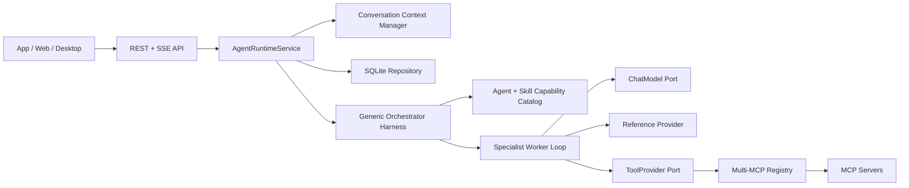

# Nino Agent

Nino Agent 是一个 API-first、多语言可演进的 Agent Harness 项目。当前可执行版本使用 Python
3.12，提供通用 Orchestrator、受控 Specialist ReAct Worker、共享 Agent/Skill 契约、多 MCP
ToolProvider、SQLite 多轮会话和 Loop Engineering。独立的 .NET MCP Server 提供演示数据能力。

当前版本：`0.10.0`。

## 当前能力

- FastAPI REST + SSE，不依赖 CLI 作为产品入口。
- 业务无关的 `nino.orchestrator`，普通问题直接回答，任务问题动态选择 Agent + Skill。
- lightweight 与 LangGraph 两种 Specialist ReAct Worker。
- 原生 OpenAI-compatible 与 LangChain 模型 Adapter。
- DeepSeek Tool Calling 和 thinking `reasoning_content` 回传。
- 多 MCP Server 发现、Tool 名称冲突检测、必需/可选服务故障隔离。
- Agent + Skill 双重 Tool 白名单、Reference 按需加载和目录逃逸保护。
- SQLite Conversation、Message、Run、Event、上下文摘要与 Loop checkpoint。
- 基于 token 预算的溢出压缩；短会话不会重复压缩。
- Loop step/action/timeout/连续失败/无进展/重复 Action 约束。
- Docker Compose 启动 Runtime、.NET MCP 和 PostgreSQL。

当前没有实现 ACP Adapter、Web 前端、身份认证、多实例共享存储、写操作审批、持久化任务图和
进程重启后的自动 Loop resume。这些能力不会在文档中描述成已完成。

## 总体架构



依赖方向：

```text
API -> Runtime -> Framework Ports
Harness -> Framework Ports
Infrastructure -> Framework Ports
Bootstrap -> 选择并组装具体 Adapter
```

Framework 不引用 FastAPI、SQLite、httpx、LangChain、LangGraph 或 MCP SDK。

## 两层 Loop

一次用户 Run 包含两个不同职责的循环。

```text
Orchestration Loop
  understand -> direct answer OR dispatch -> observe result -> reconcile -> finish/re-dispatch

Worker ReAct Loop
  reason -> tool/reference action -> observation -> continue/final answer
```

主模型只看到候选能力摘要和 `nino_runtime_dispatch_agent`，看不到业务 MCP Tools。选中的
Specialist 才加载完整 Skill、References 和白名单内 MCP schema。

两个 Loop 共用稳定状态：

- `kind`: `orchestration` 或 `worker_react`。
- `status`: `running/completed/failed/cancelled`。
- `step/max_steps`。
- `action_count/max_actions`。
- `successful_actions/failed_actions/consecutive_failures/no_progress_steps`。
- `elapsed_ms/timeout_seconds`。
- `last_action_hash`，不保存完整参数。
- `stop_reason/error_code`。

每次模型调用前、Observation 后和终止时产生 `loop_checkpoint`。事件写入 SQLite
`run_events`，可通过以下接口读取：

```text
GET /api/v1/runs/{run_id}/loop-checkpoint
GET /api/v1/runs/{run_id}/loop-checkpoint?kind=orchestration
GET /api/v1/runs/{run_id}/loop-checkpoint?kind=worker_react
```

Loop 详细状态机、预算和恢复边界见 [Loop Engineering 设计](./doc/loop-engineering-design.md)。

## 目录

```text
nino-agent/
├── agent/
│   ├── shared/                    # 跨语言 Agent/Skill/Reference/JSON Schema
│   ├── python/                    # 当前可执行 Agent Runtime
│   ├── nodejs/                    # 后续语言实现预留
│   └── dotnet/                    # 后续语言实现预留
├── mcp/dotnet/                    # 当前可执行 .NET MCP Server
├── database/                      # PostgreSQL migration、seed、验证 SQL
├── nino-agent-storage/            # 本地 SQLite Runtime 数据
├── doc/                           # 设计、调用链和运行手册
├── web/                           # 尚未实现
├── docker-compose.yml
└── .env.example
```

Python 内部层次：

```text
agent/python/src/
├── api/                           # REST/SSE DTO 与 transport
├── runtime/                       # Conversation/Run/context/event 生命周期
├── harness/                       # Orchestrator、Loop、ReAct、Skill/Agent policy
├── framework/                     # 稳定实体和 Ports
├── infrastructure/               # Model/MCP/SQLite Adapter
└── bootstrap.py                   # Composition Root
```

## Shared 扩展规则

`agent/shared` 是跨语言唯一事实源：

```text
shared/
├── contracts/
├── agents/
└── skills/
```

新增业务按实际能力增加：

1. Specialist Agent：角色、capabilities、Skill/Tool 权限和 Loop 预算。
2. Skill：使用场景、业务步骤、risk level、References、Tool 权限和 Loop 预算。
3. MCP Tool：真正访问外部数据或系统。
4. 测试：能力路由、权限拒绝、Tool 结果和事件链。

主 Orchestrator 不追加业务名称。Runtime 根据新 Agent + Skill 自动生成 Capability Catalog。

Loop 配置示例：

```json
{
  "max_steps": 5,
  "loop": {
    "max_actions": 6,
    "timeout_seconds": 60,
    "max_consecutive_failures": 2,
    "max_no_progress_steps": 2
  }
}
```

Worker 使用 Agent 与 Skill 两层中更严格的值，任何业务配置都不能放宽 Runtime 硬限制。
Runtime 硬限制由 `NINO_LOOP_HARD_MAX_STEPS`、`NINO_LOOP_HARD_MAX_ACTIONS`、
`NINO_LOOP_HARD_TIMEOUT_SECONDS`、`NINO_LOOP_HARD_MAX_CONSECUTIVE_FAILURES` 和
`NINO_LOOP_HARD_MAX_NO_PROGRESS_STEPS` 配置。

## 启动 Demo

```bash
cd /Users/wangzewei/Documents/Code/github/luck/AiAgent/newagent-vv/nino-agent
docker compose up -d --build
docker compose ps
curl -s http://127.0.0.1:8090/health
```

接口：

- Runtime：`http://127.0.0.1:8090`
- Swagger：`http://127.0.0.1:8090/docs`
- MCP：`http://127.0.0.1:8091/mcp`
- PostgreSQL：`localhost:55432`

Demo 模式不调用真实模型或 MCP，适合验证 API、路由、Loop、持久化和事件。

## DeepSeek Live

项目根目录 `.env`：

```dotenv
NINO_RUNTIME_MODE=live
NINO_AGENT_ENGINE=lightweight
NINO_MODEL_ADAPTER=native
NINO_MODEL_NAME=deepseek-v4-pro
NINO_MODEL_API_KEY=<your-key>
NINO_MODEL_BASE_URL=https://api.deepseek.com
NINO_MODEL_THINKING=disabled
NINO_MODEL_REASONING_EFFORT=
```

首次联调先关闭 thinking。Tool Calling 通过后再启用：

```dotenv
NINO_MODEL_THINKING=enabled
NINO_MODEL_REASONING_EFFORT=high
```

完整配置和验收见 [DeepSeek 启动手册](./doc/deepseek-agent-runbook.md)。API Key 不能写入 Skill、
README、Dockerfile 或版本库。

## 测试

```bash
cd agent/python
.venv/bin/python -m unittest discover -s tests -v
.venv/bin/python -m compileall -q src tests
```

验收不仅检查最终文本，还必须检查：

```text
orchestration loop checkpoint
-> nino_runtime_dispatch_agent
-> agent_started + selected Skill
-> worker loop checkpoint
-> reference/MCP tool_started + tool_completed
-> agent_completed
-> orchestration final checkpoint
-> run_completed
```

## 权威文档

- [Loop Engineering 设计](./doc/loop-engineering-design.md)
- [通用 Orchestrator 设计](./doc/generic-orchestrator-design.md)
- [Runtime 调用链与多 MCP](./doc/agent-runtime-call-chain.md)
- [Python Runtime API](./doc/python-agent-runtime-api.md)
- [多语言分层规范](./doc/multi-language-agent-architecture.md)
- [DeepSeek 启动与验收](./doc/deepseek-agent-runbook.md)
