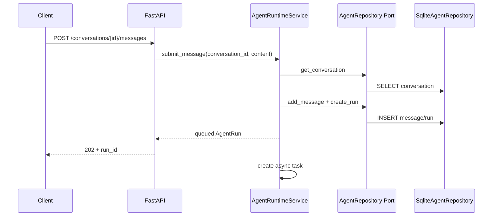
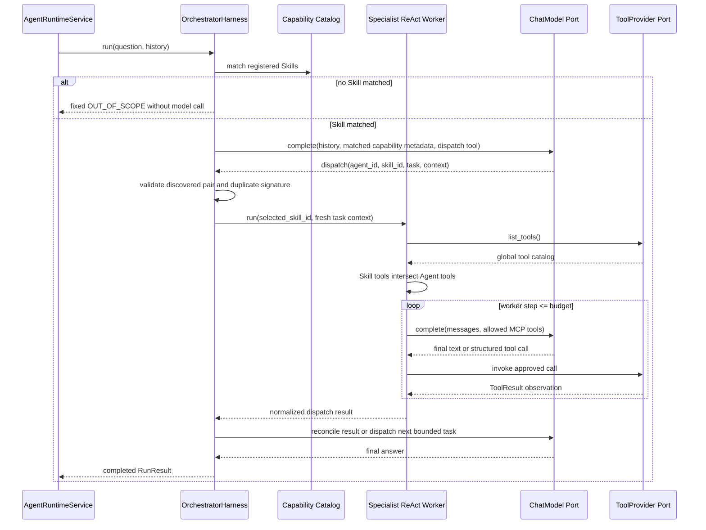
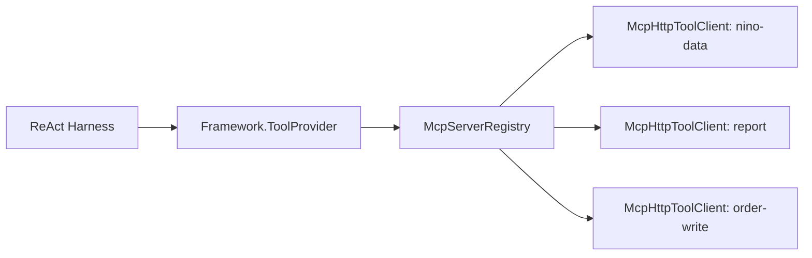

# Agent Runtime v0.10 调用链与多 MCP 设计

## 1. 分层和依赖方向

```text
API
  -> Runtime.AgentRuntimeService
      -> Framework.AgentHarness
      -> Framework.AgentRepository

Harness
  -> Framework.ChatModel
  -> Framework.ToolProvider

Infrastructure
  -> implements ChatModel
  -> implements ToolProvider with McpServerRegistry
  -> implements AgentRepository with SQLite
```

Framework 不引用 FastAPI、httpx、SQLite、LangChain、LangGraph 或 MCP SDK。它只定义消息、Tool、Conversation、Run、Event、`HarnessStepState` 和 Port。

Python 不再使用 `nino_agent_runtime` 包装目录。Framework 类型直接从顶层 `framework` package 导入，其他层同理。

## 2. 用户提交问题



同一 Conversation 同时只能有一个活动 Run。不同 Conversation 共享全局并发信号量。

## 3. 恢复和压缩上下文

```text
AgentRuntimeService._execute
  -> AgentRepository.list_messages
  -> ConversationContextManager.build
      -> token count <= history budget: full history
      -> persisted summary exists:
          -> summary + messages after cursor fit: reuse without compression
          -> composed context over budget: compact only older delta and advance cursor
      -> no summary and raw history over budget:
          -> keep recent turns and create initial summary
      -> compression performed: AgentRepository.upsert_context
  -> AgentHarness.run(user_input, history)
      -> repeated AgentHarness.step(HarnessStepState)
```

消息表是权威历史，`conversation_contexts` 是可重新生成的派生摘要。默认历史预算为：

```text
128K model context - 32K reserved = 96K history budget
```

压缩后最多保留 48K 最近原文和 12K 较早摘要。原始消息不会删除。实际模型窗口通过 `NINO_MODEL_CONTEXT_TOKENS` 配置。

## 4. 通用 Orchestrator 与 Worker ReAct 调用链



主模型在首次 dispatch 前返回自由文本会被 `DISPATCH_REQUIRED` 拒绝；所有子 dispatch 均失败时
会被 `SUCCESSFUL_DISPATCH_REQUIRED` 拒绝。Worker 在没有成功业务 Tool
Observation 时返回事实性文本会被 `EVIDENCE_REQUIRED` 拒绝；只有简短澄清问题可以无证据结束。
三类拒绝都会产生 `policy_rejected`，并写入终态 `loop_checkpoint`。

缺参澄清也必须通过内部结构化 Action `nino_runtime_request_clarification`，成功后产生
`clarification_requested`。Worker 直接返回澄清文本仍会被 `EVIDENCE_REQUIRED` 拒绝。

Orchestrator 和 Worker 使用不同的内部 Tool：

- `nino_runtime_dispatch_agent` 只存在于控制面，用于选择已发现的 Agent + Skill 组合。
- `nino_runtime_load_reference` 由 `ReferenceProvider` 执行。
- 业务 MCP Tool 只暴露给选中的 Specialist Worker，Orchestrator 不直接访问。

关键词路由仅保留为无 Orchestrator 的底层 Worker 兼容入口，不再决定 API 请求的业务流程。

`run()` 是 Runtime 与 Harness 之间的一次任务边界，`step()` 是 Harness 内部的一次模型决策边界。
Harness 生成结构化 checkpoint，Runtime 负责持久化，但 Runtime 不承担 Prompt、Tool allowlist 或
Observation 拼装。

当前已实现结构化 Loop checkpoint：Orchestration 和 Worker 在 `before_model`、
`after_observation`、`terminal` 阶段产生 `loop_checkpoint`。Runtime 通过既有 event callback 写入
SQLite `run_events`，不建立第二套可冲突状态源。checkpoint 保存预算、计数、耗时、状态、停止原因
和 Action hash，不保存隐藏推理与完整参数。

```text
GET /api/v1/runs/{run_id}/loop-checkpoint
GET /api/v1/runs/{run_id}/loop-checkpoint?kind=orchestration
GET /api/v1/runs/{run_id}/loop-checkpoint?kind=worker_react
```

Loop checkpoint 用于进度、审计和节点内故障定位。宏观 crash recovery 已由持久化 TaskGraph 和
NodeAttempt 实现：重启后旧 Attempt 标记为 `interrupted`，新 Attempt 从 Root Node 重新执行；它不恢复
隐藏推理，也不在模型调用中间续跑。

## 5. 多 MCP 发现和路由



`McpServerRegistry.list_tools()`：

1. 并行初始化所有配置的 MCP Server。
2. 调用每个 Server 的 `tools/list`。
3. 聚合 Tool Definition。
4. 建立 `tool_name -> server_id` 路由表。
5. 检测全局 Tool 名称冲突；冲突时拒绝启动目录。
6. 必需 Server 失败时整体发现失败。
7. 可选 Server 失败时隔离该 Server，其他 Tool 继续可用。

`McpServerRegistry.invoke()` 不做业务权限判断，只按已发现的路由调用所属 Client。Skill/Agent 白名单在 Harness 中执行。

## 6. 多 MCP 配置

单 MCP 兼容配置：

```text
NINO_MCP_URL=http://127.0.0.1:8091/mcp
NINO_MCP_SERVERS=
```

多 MCP 使用 JSON：

```json
[
  {
    "id": "nino-data",
    "url": "http://127.0.0.1:8091/mcp",
    "required": true,
    "timeout_seconds": 30
  },
  {
    "id": "report",
    "url": "http://127.0.0.1:8092/mcp",
    "required": false,
    "timeout_seconds": 20
  }
]
```

当前 Registry 实现 Streamable HTTP。未来增加 stdio 时，应新增 Client Adapter，不修改 Runtime 和 ToolProvider Port。

查询 Registry 状态：

```text
GET /api/v1/mcp/servers
GET /api/v1/mcp/servers?discover=true
```

`discover=false` 只返回当前缓存状态；`discover=true` 会触发 MCP 初始化和 Tool 发现。

## 7. Tool 权限链

```text
Registry discovered tools
  intersect Skill.allowed_tools
  intersect Agent.allowed_tools
  = tools exposed to the model
```

模型不能注册 MCP Server、修改 Registry 配置或绕过 Tool allowlist。MCP Server URL 只能来自进程环境/受信配置。

## 8. 结果持久化和 SSE

```text
Runtime event callback
  -> AgentRuntimeService.save_event
  -> AgentRepository.append_event
  -> SQLite run_events
  -> SSE /runs/{id}/events/stream
```

Run 完成后 AgentRuntimeService 更新 `runs`，并把最终回答写为 assistant message。客户端断线后可用 `after` 或 `Last-Event-ID` 从 SQLite 续接事件。

## 9. 容器生命周期

`agent-runtime` 容器状态排查结果：

- `Paused=false`
- `OOMKilled=false`
- `ExitCode=0`
- 日志为 Uvicorn 正常 `Shutting down -> Application shutdown complete`

这说明容器是被正常 stop/recreate，不是代码崩溃。开发时不要同时运行本地 Uvicorn 和 Compose 容器占用 8090。

统一操作：

```bash
docker compose up -d --build agent-runtime
docker compose ps
docker compose logs -f agent-runtime
```

Compose 使用 `restart: unless-stopped`。显式执行 `docker compose stop agent-runtime` 后，Docker 按设计不会自动启动它；需要再次执行 `docker compose start agent-runtime` 或 `up -d`。
