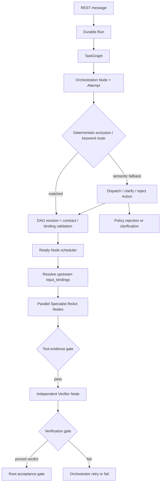

# Enterprise Harness Kernel

## 1. 当前定位

Nino Agent 当前是 API-first 的企业领域 Agent Harness。REST + SSE 是产品协议，ACP 不在当前范围。
TaskGraph 管理宏观任务真相，ReAct/LoopController 只管理一个 Node 内部的模型、Action 和
Observation，二者不能合并。

## 2. 已实现调用链



Graph、Node、Gate、Attempt 都写入 `nino-agent-storage/nino-agent.db`。接口：

```text
GET /api/v1/runs/{run_id}/task-graph
GET /api/v1/runs/{run_id}/task-graph/lint
GET /api/v1/runs/{run_id}/task-graph/nodes
GET /api/v1/runs/{run_id}/task-graph/gates
GET /api/v1/runs/{run_id}/task-graph/attempts
```

## 3. 状态职责

| 状态 | 职责 |
|---|---|
| Conversation/Message | 多轮用户语义历史 |
| Run/Event | API 执行状态和 SSE 事件流 |
| TaskGraph | 一次请求的宏观控制真相 |
| TaskNode | Orchestration、Specialist、Verification 等语义工作边界 |
| AcceptanceContract | Node 可以声称完成的明确条件 |
| TaskGate | evidence、independent verification、acceptance 判定 |
| NodeAttempt | 每次执行或恢复尝试，历史不可覆盖 |
| Loop checkpoint | 单个 Node 内部的有界 ReAct 快照 |

## 3.1 路由、Workflow 与 Assurance

Skill 的确定性 `excluded_intent_keywords` 始终优先。关键词命中时直接形成候选目录；未命中时，
只有显式声明 `routing.semantic_fallback=true` 的 Skill 才进入语义候选目录。Orchestrator 在语义回退
阶段不能自由回答，只能调用结构化 dispatch、clarification 或 rejection Action。

Skill 分别声明 `workflow.id/workflow.execution_shape`、`assurance.mode/
assurance.required_evaluators` 以及具体 Worker 指令。Workflow 描述任务拓扑，Assurance Policy 描述
完成条件，Skill 正文、Tool 和 Reference 描述单个 Specialist Node 如何执行。

## 3.2 DAG 数据流和节点合同

`depends_on` 负责控制依赖；`input_bindings` 负责数据依赖：

```json
{
  "name": "upstream_metrics",
  "source_node_id": "query-summary",
  "selector": "outputs"
}
```

允许选择 `summary`、`outputs`、`findings`、`evidence`、`concerns` 或 `recommended_next`。
Binding source 必须同时出现在 `depends_on`；没有显式 binding 时，Harness 默认注入每个依赖节点的
summary。下游 Worker 只收到裁剪后的结构化输入，不接收父 Agent 完整上下文或原始 Tool dump。

每个 dispatch 可携带业务化 `AcceptanceContract`，该合同同时进入 Worker 输入、Verifier 输入和持久化
TaskNode。Worker 结果统一归一化为 `status/summary/outputs/evidence/findings/concerns/
recommended_next/error_code/retryable`；自由文本 Worker 仍兼容，但会被收敛为最小结构化结果。

## 4. 崩溃恢复

SQLite 初始化不再把 `queued/running` Run 直接判为失败：

1. Runtime 以 `runtime_instances` 心跳声明存活状态。
2. 非正常退出或正常停机留下的失效 lease 会被新 Runtime 接管。
3. `running` Run 和 Graph 返回 `queued/pending`，旧 Attempt 标记为
   `interrupted/RUNTIME_RESTARTED`。
4. FastAPI lifespan 启动时扫描 durable queue，使用原始 trigger 和 conversation history 重跑
   Root Orchestration。
5. 已完成的稳定 Node ID 直接复用 `result_json`；未完成 Node 创建递增 Attempt 后重新执行。
6. 事件 sequence 通过 SQLite `BEGIN IMMEDIATE` 原子分配，在旧序列后继续。

当前恢复采用 at-least-once 重新执行，所以只允许 read-only Skill。接入 write Skill 前必须实现 Tool
幂等键、审批和 Action ledger，否则不能开放写操作。

## 5. 独立验证

Verifier 不在 Orchestrator 的普通候选目录中，模型不能把验证角色当成分析角色。分析完成后由 Harness
确定性调度 Verifier。Verifier 必须重新调用白名单内只读 Tool，并调用内部 Action
`nino_runtime_submit_evaluator_verdict` 返回符合 `evaluator-verdict.schema.json` 的结构化结论。只有
`verdict=passed`、`evidence_level=proved` 且存在 Tool evidence 时 Gate 才能通过；不再解析自由文本
中的 `PASS`。

验收角色由 Skill 的 `assurance.required_evaluators` 声明，可按顺序选择 `verification`、`review`、
`critique`。Harness 根据 Agent capability 解析角色，并把多个 Evaluator 编译为依赖链；任一 Gate
失败都会阻断后续 Gate 和本次 dispatch。

## 6. 并发与一致性

- 每个 Conversation 由数据库部分唯一索引限制为一个 active Run。
- Run 与 trigger message 原子创建；Event sequence 由数据库原子分配。
- Graph revision 和终态更新使用 version CAS，冲突返回 `GRAPH_VERSION_CONFLICT`。
- `TaskGraphScheduler` 只计算 DAG Ready/Blocked 集合；Repository 在执行前原子 claim Node 并检查
  dependency + required Gate，这是最终执行授权。
- Node、Gate、Attempt 在一个事务中收口；MCP Registry 对每个 Server 实施 semaphore 和熔断。

## 7. 尚未实现

以下能力不能描述成已经完成：

- 不重放 Root 模型规划、直接从任意未完成 DAG Node 继续的完全精确调度恢复。
- write/privileged Skill 的人工审批、幂等 Tool 执行和补偿事务。
- 身份认证、租户隔离、RBAC、行级数据权限和可信审批人身份。
- 远程共享数据库上的跨主机租约协调；当前 lease 只对共享同一个 SQLite 文件的进程有效。
- MCP Tool schema TTL、周期健康检查和持久化 Action ledger。
- Node.js/.NET Runtime 的 TaskGraph conformance implementation。
- 基于 embedding/reranker 的大规模 Capability 召回；当前语义回退由主模型在显式 opt-in 候选中判定。
- 独立 Workflow Registry；当前 Workflow/Assurance 已是独立 manifest 契约，但仍随 Skill 加载。

Orchestrator 当前通过一轮结构化 dispatch tool calls 形成一个 Graph revision。每个调用可携带稳定
`node_id`、`depends_on`、`input_bindings` 和 `acceptance_contract`；Harness 在执行前拒绝未知依赖、
错误 binding、重复 ID 和环，然后按 Ready 集合分波执行。
后续模型轮次可以追加 `graph_reconciled` revision，已完成历史不会被删除。

在仍保持只读范围的前提下，下一阶段应优先完成跨语言 Conformance Kit、MCP schema TTL/健康检查、
损坏上下文安全降级，以及 Run/Event/Graph 终态的单一事务提交。ACP 和多宿主 Coding Agent 集成
不是当前企业 Agent 产品的前置条件。
