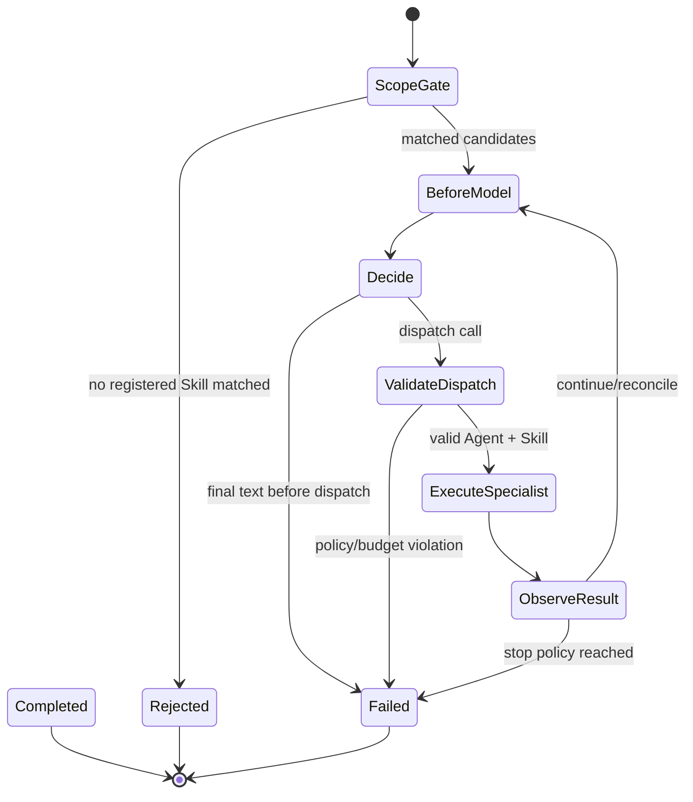
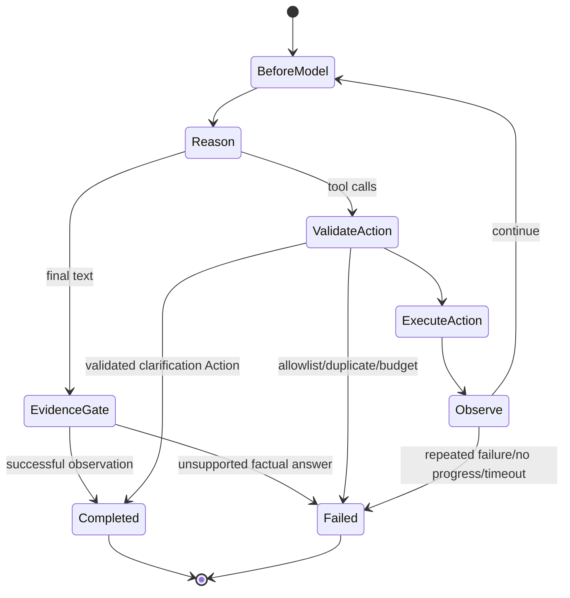

# Nino Agent Loop Engineering 详细设计

> 版本：0.10.0  
> 日期：2026-07-17  
> 状态：本文区分已实现能力和后续设计，代码与测试是最终行为依据。

## 1. 目标

Loop Engineering 将模型的多步执行从一个隐含 `while/for` 循环提升为可约束、可观察、可持久化、
可测试的运行机制。它解决以下问题：

- 模型最多可以思考和调用多少次？
- 重复调用、连续错误和无进展如何停止？
- Orchestrator Loop 与 Specialist ReAct Loop 如何使用统一语义？
- 前端如何知道 Agent 当前处于哪一步，而不是只看到 loading？
- 服务异常时，哪些状态已经持久化，哪些动作不能盲目重放？
- Python、Node.js、.NET 如何实现相同的循环协议？

Loop 不负责业务路由规则、数据库查询、MCP transport 或 HTTP DTO。它只负责执行边界和状态演进。

## 2. 两类 Loop

### 2.1 Orchestration Loop

责任：Skill 范围门禁、能力选择、派发、消费子结果、继续派发或结束。



主模型只获得 Capability Catalog 和 `nino_runtime_dispatch_agent`，不获得业务 MCP Tool。

### 2.2 Worker ReAct Loop

责任：加载选定 Skill，执行 Reason/Action/Observation，返回有证据的任务结果。



lightweight 与 LangGraph Worker 都使用相同的 Loop 状态、预算和停止语义。LangGraph 只改变节点
调度方式，不改变外部契约。

## 3. 稳定模型

Framework 定义位于 `agent/python/src/framework/loop.py`。跨语言实现必须保持字段语义一致。

### 3.1 LoopKind

| 值 | 含义 |
|---|---|
| `orchestration` | 主 Agent 控制面循环 |
| `worker_react` | Specialist ReAct 执行循环 |

### 3.2 LoopStatus

| 值 | 含义 |
|---|---|
| `running` | 尚可继续 |
| `completed` | 已产生合法最终回答 |
| `failed` | 预算、权限、依赖或协议失败 |
| `cancelled` | 用户或 Runtime 取消 |

### 3.3 LoopStopReason

| 值 | 典型 error code | 含义 |
|---|---|---|
| `final_answer` | 空 | 模型返回最终文本 |
| `max_steps` | `MAX_STEPS_EXCEEDED` | 模型决策轮数达到上限 |
| `max_actions` | `MAX_ACTIONS_EXCEEDED` | Action 总数达到上限 |
| `timeout` | `LOOP_TIMEOUT` | Loop 墙钟时间超限 |
| `duplicate_action` | `DUPLICATE_ACTION` / `DUPLICATE_TOOL_CALL` | 相同名称和参数重复执行 |
| `consecutive_failures` | `LOOP_CONSECUTIVE_FAILURES` | 连续 Action 失败达到阈值 |
| `no_progress` | `LOOP_NO_PROGRESS` / `EMPTY_MODEL_RESPONSE` | 多次 Observation 未产生进展 |
| `policy_violation` | `TOOL_NOT_ALLOWED` 等 | Agent/Skill/候选目录权限失败 |
| `dependency_error` | `DEPENDENCY_ERROR` | Model、MCP 或其他依赖失败 |
| `cancelled` | `RUN_CANCELLED` | 任务被取消 |

Stop reason 是跨语言稳定分类；error code 用于更具体的 API 排障。

### 3.4 LoopSnapshot

持久化字段：

```json
{
  "run_id": "...",
  "kind": "orchestration",
  "status": "running",
  "step": 2,
  "max_steps": 8,
  "action_count": 1,
  "max_actions": 12,
  "successful_actions": 1,
  "failed_actions": 0,
  "consecutive_failures": 0,
  "no_progress_steps": 0,
  "elapsed_ms": 521,
  "timeout_seconds": 180,
  "last_action_hash": "sha256...",
  "stop_reason": null,
  "error_code": null
}
```

`last_action_hash` 是 Action 名称与规范化参数的 SHA256。checkpoint 不保存完整参数、API Key、隐藏
推理过程或 OpenAI-compatible 扩展字段 `reasoning_content`。

## 4. 预算合并

预算在 shared `agent.json` 和 `skill.json` 中声明：

```json
{
  "max_steps": 5,
  "loop": {
    "max_actions": 6,
    "timeout_seconds": 60,
    "max_consecutive_failures": 2,
    "max_no_progress_steps": 2
  }
}
```

字段约束：

| 字段 | 范围 | 说明 |
|---|---:|---|
| `max_steps` | 1-20 | 模型决策次数 |
| `max_actions` | 1-100 | Tool/dispatch Action 总数 |
| `timeout_seconds` | 1-3600 | 单个 Loop 墙钟超时 |
| `max_consecutive_failures` | 1-20 | 连续失败 Observation 上限 |
| `max_no_progress_steps` | 1-20 | 无进展 Observation 上限 |

Worker 合并规则：

```text
effective max_steps
  = min(Runtime hard max, Agent max_steps, Skill max_steps)

effective loop budget field
  = min(Runtime hard field, Agent field, Skill field)
```

低层配置只能收紧，不能扩大上层权限和预算。Orchestrator 没有业务 Skill，因此使用 primary Agent
预算与 Runtime hard max。

当前配置：

| Loop | max steps | max actions | timeout |
|---|---:|---:|---:|
| Orchestrator | 8 | 12 | 180 秒 |
| Data Analyst Agent | 5 | 8 | 90 秒 |
| Data Verifier Agent | 5 | 8 | 90 秒 |
| Data Analysis Skill | 5 | 6 | 60 秒 |
| Data Worker 有效值 | 5 | 6 | 60 秒 |

## 5. LoopController

纯策略实现位于 `agent/python/src/harness/loop.py`，不依赖模型或基础设施。

调用顺序：

```text
begin_step
  -> check timeout
  -> check max steps
  -> increment step

register_action(signature)
  -> check timeout
  -> check max actions
  -> reject duplicate
  -> increment action_count and store hash

record_observation(succeeded)
  -> success: reset failure/no-progress counters
  -> failure: increment counters
  -> evaluate consecutive failure/no progress/timeout

stop(status, reason, error_code)
  -> freeze terminal meaning for checkpoint
```

模型不能自行修改 LoopSnapshot 或预算。所有计数来自 Harness 真实执行结果。

## 6. Checkpoint 与 SQLite

checkpoint 使用现有事件链作为唯一持久化事实源：

```text
Harness emits loop_checkpoint
-> Runtime on_event callback
-> AgentRepository.append_event
-> SQLite run_events
-> REST/SSE replay
```

产生时机：

| phase | 时机 |
|---|---|
| `before_model` | 每次模型决策前，step 已增加 |
| `after_observation` | Tool 或 dispatch 结果已记账 |
| `terminal` | completed/failed/cancelled 状态确定后 |

读取接口：

```text
GET /api/v1/runs/{run_id}/loop-checkpoint
GET /api/v1/runs/{run_id}/loop-checkpoint?kind=orchestration
GET /api/v1/runs/{run_id}/loop-checkpoint?kind=worker_react
```

返回标准 `EventResponse`。不传 `kind` 时返回整个父 Run 中最后一个 checkpoint。SSE 会实时推送
同一种事件，客户端断线后按 event sequence 重放。

子 Worker checkpoint 被归并进父 Run，并带有：

- `parent_step`
- `child_run_id`
- `agent_id`
- `skill_id`

当前不建立单独 `loop_checkpoints` 表，避免事件表和快照表出现双写不一致。后续数据量需要优化时，
可以增加由事件投影生成的 latest snapshot 表，但事件仍是权威来源。

## 7. 事件顺序

数据查询的典型事件：

```text
run_started
loop_checkpoint                  orchestration / before_model
model_started                    orchestration
model_completed
tool_started                     nino_runtime_dispatch_agent
agent_started
skill_selected
loop_checkpoint                  worker_react / before_model
model_started                    worker
model_completed
tool_started                     reference or MCP
tool_completed
loop_checkpoint                  worker_react / after_observation
...
loop_checkpoint                  worker_react / terminal
agent_completed
tool_completed                   dispatch result
loop_checkpoint                  orchestration / after_observation
loop_checkpoint                  orchestration / before_model
model_started                    reconciliation
model_completed
loop_checkpoint                  orchestration / terminal
run_completed
```

最终文本不是唯一验收依据。业务事实必须能追溯到 Worker 的 MCP Tool 事件。

## 8. 失败处理

| 场景 | 当前行为 | 是否自动重试 |
|---|---|---|
| 重复 Action | 立即失败，避免重复副作用和死循环 | 否 |
| Action 超预算 | 立即失败 | 否 |
| step 超预算 | 立即失败 | 否 |
| Tool 返回错误 | 记录失败 Observation；未到阈值时允许模型修正 | 模型可选择不同 Action |
| 连续 Tool 错误 | 达阈值后停止 | 否 |
| Model/MCP 网络错误 | `dependency_error` | 否 |
| 用户取消 | checkpoint cancelled，Run cancelled | 否 |
| Runtime 进程重启 | 遗留 Run 标记 `RUNTIME_RESTARTED` | 否 |

当前没有基础设施级自动重试。对读取操作增加重试前需要定义错误分类、退避和最大次数；对写操作
重试前必须有幂等键，不能用通用 retry 重复创建订单或退款。

## 9. Checkpoint 不等于自动 Resume

v0.10.0 checkpoint 用于：

- UI 展示当前进度和预算。
- 排查停止原因。
- 审计模型/Tool 执行边界。
- 为后续恢复设计提供稳定状态。

它暂不承诺进程重启后从中间 step 自动续跑，原因包括：

1. Tool Calling 恢复需要完整且协议合法的 assistant/tool 消息序列。
2. thinking 模式可能要求同一轮 `reasoning_content` 协议回传，但不应把隐藏推理长期持久化。
3. 已成功的写操作不能因恢复而重复执行。
4. MCP Tool 必须提供幂等键、操作查询和结果确认语义。

正确的恢复方案应持久化结构化任务图、幂等 Action 记录和可重建协议上下文，而不是简单重新运行
最后一个模型 step。

## 10. 安全边界

- checkpoint 不保存 API Key、Authorization Header 或数据库连接串。
- checkpoint 不保存完整 Tool 参数，只保存 Action hash。
- 不持久化或展示隐藏 chain-of-thought。
- `reasoning_content` 仅在当前 Tool Calling Loop 内按模型协议回传。
- Loop 预算不能扩大 Agent/Skill Tool allowlist。
- Orchestrator 无权直接调用业务 MCP Tool。
- write/privileged Skill 后续必须增加 approval gate 和幂等记录。

## 11. API 与前端建议

前端收到 `202 + run_id` 后：

1. 连接 `/events/stream`。
2. 使用 `loop_checkpoint` 更新进度条和阶段，不使用伪造百分比。
3. `kind=orchestration` 显示“正在选择能力/汇总结果”。
4. `kind=worker_react` 显示具体 Specialist 与 Skill，不展示隐藏推理。
5. `stop_reason` 非 `final_answer` 时展示稳定失败原因和可重试建议。
6. 断线后使用 `Last-Event-ID` 续接，或读取 latest checkpoint。

推荐展示字段：step/max_steps、action_count/max_actions、elapsed/timeout、Agent、Skill、当前 Tool、
status 和 stop reason。

## 12. 测试标准

当前自动测试覆盖：

- 完成状态和 checkpoint 不泄露原始 Action 参数。
- 重复 Action 停止。
- Action 预算停止。
- 连续失败停止。
- Agent/Skill 使用更严格预算。
- lightweight Worker checkpoint。
- LangGraph Worker 保持相同 Loop 语义。
- Orchestrator 模型前范围拒绝、dispatch required 与 dynamic dispatch。
- Worker 的 successful Observation evidence gate，以及结构化
  `nino_runtime_request_clarification` Action。
- API 从 SQLite 读取 orchestration/worker terminal checkpoint。
- SSE 事件严格递增。

每增加一种 Loop 策略，至少补充正常完成、预算停止、权限失败、依赖失败、取消和持久化回放测试。

## 13. 后续演进

下一阶段按以下顺序实施：

1. `TaskGraph/TaskNode/Gate` 稳定模型与 SQLite 持久化。
2. 任务依赖、独立节点并行和每节点 acceptance criteria。
3. Evaluator Port 与确定性 gate，不默认无限反思。
4. write/privileged 的 `awaiting_approval` 状态、幂等键和审计。
5. 可重建协议上下文和 Action ledger。
6. 在安全前提下实现 crash resume。
7. Node.js/.NET 使用共享 fixtures 通过 Loop contract tests。

TaskGraph 管理任务关系，LoopController 管理单个执行循环，两者不能合并成一个无边界的大状态机。
