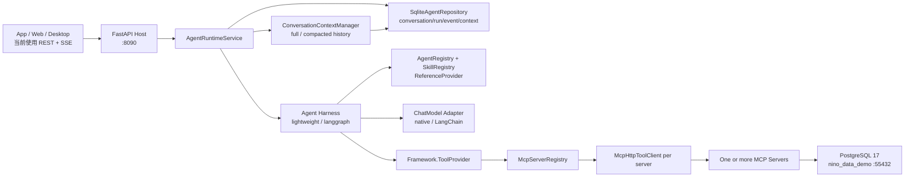
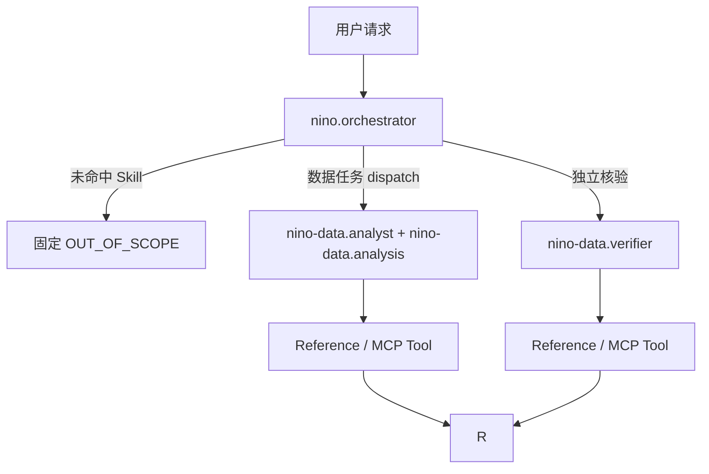

# Nino Data Agent 当前实现与演进设计

> 文档基线：`nino-agent` v0.12，2026-07-17
> 目标：准确描述仓库中已经存在的实现，并把尚未实现的 Web 和生产能力明确列为后续工作。

Runtime、Framework、SQLite 和多 MCP 的逐步调用过程见 [`agent-runtime-call-chain.md`](./agent-runtime-call-chain.md)。

## 1. 当前结论

当前仓库已经形成一个可执行的、API-first 的 ReAct Agent MVP：

- Agent Runtime 使用 Python 3.12 和 FastAPI，对外提供 REST + SSE。
- ReAct 引擎同时支持项目自研轻量循环和 LangGraph 实现。
- 模型层支持原生 OpenAI-compatible HTTP Adapter，也支持 LangChain Adapter。
- Agent 通过标准 MCP Streamable HTTP 调用独立的 .NET 10 数据服务。
- 数据服务只开放三个强类型、只读、参数化查询工具，不开放任意 SQL。
- 共享目录中有一个 `nino-data.analysis` Skill、四个按需加载 Reference、一个通用主 Agent 和两个业务 Specialist。
- `nino.orchestrator` 是业务无关入口，通过能力目录动态选择兼容的 Specialist + Skill，最大派发深度为 1。
- 会话、消息、Run、事件和压缩上下文已经使用本地 SQLite 持久化。
- TaskGraph、TaskNode、Gate 和 NodeAttempt 已持久化；中断 Run 可在重启后创建新 Attempt 恢复。
- Analyst 结论必须经过独立 Verifier 重新取证并通过 Verification Gate。
- 同一 `conversation_id` 支持跨进程重启继续追问；长历史会按模型 token 预算动态压缩。
- Web 前端、身份认证和 OpenTelemetry 尚未实现；ACP 不在当前产品范围。

因此，不能把当前项目描述为 .NET Agent Runtime、ACP 已接入或完整生产平台。`.NET` 目前只用于 MCP Server。

## 2. 实际项目结构

以下结构与当前仓库一致，省略 `.venv`、`bin`、`obj` 和缓存目录：

```text
nino-agent/
├── agent/
│   ├── README.md
│   ├── shared/
│   │   ├── contracts/
│   │   │   ├── agent.schema.json
│   │   │   └── skill.schema.json
│   │   ├── skills/
│   │   │   └── nino-data-analysis/
│   │   │       ├── skill.json
│   │   │       ├── SKILL.md
│   │   │       └── references/
│   │   │           ├── metric-definitions.md
│   │   │           ├── order-query-rules.md
│   │   │           ├── anomaly-rules.md
│   │   │           └── report-output-spec.md
│   │   └── agents/
│   │       ├── orchestrator/{agent.json,AGENT.md}
│   │       ├── nino-data-analyst/{agent.json,AGENT.md}
│   │       └── nino-data-verifier/{agent.json,AGENT.md}
│   ├── python/
│   │   ├── pyproject.toml
│   │   ├── Dockerfile
│   │   ├── README.md
│   │   ├── src/{api,runtime,harness,framework,infrastructure}/
│   │   └── tests/
│   ├── nodejs/README.md              # 仅预留，尚无 Runtime
│   └── dotnet/README.md              # 仅预留，尚无 Agent Runtime
├── mcp/
│   └── dotnet/
│       ├── Nino.Data.Mcp.slnx
│       ├── Directory.Build.props
│       ├── Directory.Packages.props
│       ├── Dockerfile
│       ├── src/Nino.Data.Mcp/
│       └── tests/Nino.Data.Mcp.Tests/
├── database/
│   ├── migrations/{001_init.sql,002_mcp_readonly.sql}
│   ├── seeds/001_demo_data.sql
│   ├── queries/verification.sql
│   └── tests/assertions.sql
├── doc/
├── nino-agent-storage/
│   ├── README.md
│   └── nino-agent.db                 # 运行时生成，不提交 Git
├── web/                              # 当前为空，尚未实现
├── docker-compose.yml
└── .env.example
```

语言隔离原则已经落地：Python Agent 和 .NET MCP 不共享内部代码，只通过 MCP、HTTP 和共享 JSON/Markdown 契约协作。未来 Node.js 或 .NET Agent Runtime 应放在对应语言目录，不能直接引用 Python package。

## 3. 当前运行架构



### 3.1 Agent Framework

当前已经建立独立的顶层 `framework` package，只保存无基础设施依赖的稳定抽象：

| 文件 | 当前职责 |
|---|---|
| `framework/models.py` | Message、ToolCall、ToolDefinition、ToolResult、AgentEvent、RunResult |
| `framework/conversation.py` | Conversation、ConversationMessage、ConversationContext、AgentRun |
| `framework/ports.py` | `ChatModel`、`ToolProvider`、`AgentHarness` Protocol |
| `framework/repositories.py` | `AgentRepository` 等持久化 Port |
| `harness/skills.py` | `Skill`、能力元数据、fallback 路由和 manifest 校验 |
| `harness/agents.py` | `AgentDefinition`、动态候选发现、primary/specialist 和权限校验 |
| `harness/orchestrator.py` | 通用控制面、Capability Catalog、结构化 dispatch 和结果归并 |
| `harness/documents.py` | `SKILL.md`、`AGENT.md` frontmatter 解析与必填校验 |
| `runtime/context.py` | 动态上下文窗口与本地提取式压缩 |
| `runtime/service.py` | Conversation/Run 生命周期、并发、取消、事件和回写 |
| `infrastructure/sqlite.py` | 默认 SQLite Conversation/Run/Event/Context Repository |

未来实现其他语言 Runtime 时，应对齐这些协议语义和 `agent/shared/contracts`，而不是复制 Python 类。

### 3.2 Agent Runtime 与 Harness

Runtime 负责持久化会话、创建 Run、恢复/压缩上下文、取消、并发和事件协调。Harness 分为通用控制面和 Specialist Worker：

- Orchestrator 先执行 Skill 白名单范围门禁，未命中固定拒绝；命中后必须选择 Agent + Skill。
- Specialist 按 Orchestrator 选定的 Skill 执行，不再由关键词预先决定 API 请求流程。
- 合并 Agent 指令、Skill 指令、会话历史和当前用户消息。
- 从 MCP 获取工具 schema，并按 Skill 与 Agent 双重白名单过滤。
- 调用模型原生 tool calling。
- 执行 MCP Tool、内部 Reference Tool 或 Delegate Tool。
- 追加 Observation，继续下一次模型判断。
- 生成严格递增的 Run 事件。
- 处理取消、重复调用、工具结果长度和最大步骤限制。

可选实现：

| `NINO_AGENT_ENGINE` | 类 | 用途 |
|---|---|---|
| `lightweight` | `ReActHarness` | 默认实现，依赖少，适合当前 MVP |
| `langgraph` | `LangGraphReActHarness` | 使用 LangGraph 状态图，但保持相同 Port 和 API |

### 3.3 Agent Harness

Harness 已经是独立目录 `harness/`，两个引擎都实现 Framework `AgentHarness` Port：

1. Harness 先匹配注册 Skill；未命中不调用模型，命中后主模型必须调用 `nino_runtime_dispatch_agent`。
2. Harness 校验 Agent + Skill 是否为动态目录中的合法组合。
3. Specialist Worker 计算 `min(skill.max_steps, agent.max_steps, hard_max_steps)`。
4. Worker 只接收 Skill/Agent 交集后的 MCP Tools 和 Reference Tool。
5. Worker 执行 ReAct，Orchestrator 消费结构化结果并决定汇总或继续派发。
6. 两层循环都阻止相同参数的重复调用，并受独立步骤预算约束。
7. 达到预算、权限越界或依赖失败时产生稳定失败结果。

ReAct 在这里表示 `Reason/Select Action -> Act -> Observe -> Continue/Answer`。系统使用模型的结构化 tool calling，不解析 `Thought:` 文本，也不向客户端暴露隐藏思维链。

## 4. Agent、Skill、Reference、Tool

| 对象 | 回答的问题 | 当前实现 |
|---|---|---|
| Agent | 谁负责执行和承担结果责任 | Orchestrator、Analyst、Verifier |
| Skill | 这类业务任务应该怎么做 | `nino-data.analysis` |
| Reference | 当前步骤需要查什么详细知识 | 指标、订单、异常、报表规则 |
| Tool | 实际读取什么外部数据 | 三个 `nino_data_*` MCP Tool |

它们不是一一对应：多个 Agent 可以复用同一个 Skill；一个 Skill 可以使用多个 Tool；Reference 只属于声明它的 Skill。

### 4.1 三层命名

| 层级 | 示例 | 作用 |
|---|---|---|
| JSON `id` | `nino-data.analysis` | Registry、API 和跨语言契约的唯一机器身份 |
| 目录 slug | `nino-data-analysis/` | 文件系统组织，当前把 `.` 转成 `-` |
| frontmatter `name` | `nino-data-analysis` | 展示和模型上下文名称 |

Loader 扫描固定的 `*/skill.json` 和 `*/agent.json`，并以 JSON `id` 注册。目录名不是协议 ID。

目录内固定使用 `SKILL.md` 和 `AGENT.md`，因为身份已经由目录、JSON `id` 和 frontmatter 表达。固定文件名让 Python、Node.js、.NET 都能使用相同发现规则，也便于同目录增加 References 和测试资源。

### 4.2 Markdown frontmatter

每个 `SKILL.md` 和 `AGENT.md` 必须以下列格式开头：

```yaml
---
name: nino-data-analysis
description: |
  Read-only Nino Data analysis workflow. Use for order queries and statistics.
  Avoid for order creation, refunds, and other write operations.
---
```

展示用 `name`、`description` 以 Markdown 为权威；权限、预算和机器 ID 以 JSON 为权威。

### 4.3 当前 Skill

当前只有一个 Skill：`nino-data.analysis`。它覆盖订单详情、分组统计、负毛利异常和报表解释，允许三个 MCP Tools，最大步骤为 5。

`skill.json` 负责：

- `id`、`version`、`instructions`。
- `excluded_intent_keywords` 先排除写入等禁用意图，`intent_keywords` 再执行确定性 Skill 白名单匹配；
  未命中不允许 fallback 到默认 Skill，也不会调用模型。
- `capabilities` 和 `risk_level` 候选元数据。
- `allowed_tools`。
- Reference 的安全 ID、相对路径和描述。
- `max_steps`。

`SKILL.md` 负责：

- Tool 选择规则。
- Reference 路由规则。
- 日期、币种、指标和证据约束。
- 回答结构和禁止事项。

后续增加 Skill 时，每个 Skill 独立建目录。只有当任务的意图、工具集合、风险等级或工作流明显不同，才应拆分新 Skill；不要仅为了文件数量拆分。

### 4.4 Reference 安全加载

模型只能调用内部工具：

```text
nino_runtime_load_reference(reference_id)
```

Runtime 不接受文件路径，并执行以下约束：

- ID 必须存在于当前 `skill.json.references`。
- 配置路径必须是相对路径且不能逃逸 Skill 目录。
- 文件必须存在。
- 单个 Reference 默认不超过 20,000 字符。
- 返回内容包含 SHA256，并产生 `reference_loaded` 事件。

当前 Reference：

| ID | 用途 |
|---|---|
| `metric-definitions` | 指标公式、币种和半开日期区间 |
| `order-query-rules` | 订单详情解释和证据要求 |
| `anomaly-rules` | 负毛利与不一致 reason code |
| `report-output-spec` | 分组结果和报表输出格式 |

### 4.5 主 Agent 与子 Agent



- 通用 Orchestrator 是唯一 `primary`，不持有业务 Skill 或 MCP Tool。
- Analyst 和 Verifier 是 `specialist`。
- 派发通过内部工具 `nino_runtime_dispatch_agent` 完成。
- `discover_delegates` 发现已注册 Specialist，但每个 Specialist 的 Skill/Tool 白名单仍是硬权限边界。
- 最大委派深度为 1，specialist 的深度预算为 0。
- 子 Agent 使用新上下文，父 Agent 只传 `task` 和可选 `context`。
- 子 Run 通过 `parent_run_id`、`child_run_id` 和 `agent_started/completed/failed` 事件建立 lineage。
- 当前子 Run 不单独写入 Repository；它的关键 lineage 事件记录在父 Run 中。

这是动态能力发现但受控权限约束的单入口编排，不是自由通信的多 Agent 群体。

## 5. 模型接入

`NINO_RUNTIME_MODE=demo` 使用确定性的 Demo Model 和 Demo Tool，不访问真实模型和 MCP，适合 API 与状态机测试。

`NINO_RUNTIME_MODE=live` 使用真实模型和 MCP：

| 变量 | 可选值/含义 |
|---|---|
| `NINO_AGENT_ENGINE` | `lightweight` 或 `langgraph` |
| `NINO_MODEL_ADAPTER` | `native` 或 `langchain` |
| 模型 | 代码中固定为 `gpt-5.4`，不接受环境变量覆盖 |
| `OPENAI_API_KEY` | 从 Runtime 进程环境读取的模型密钥 |
| `INCERRY_OPENAI_BASE_URL` | 兼容 `/v1` endpoint，当前为 `http://core.dns-pro.net:13001/v1` |
| `NINO_MCP_URL` | 默认 `http://127.0.0.1:8091/mcp` |
| `NINO_MCP_SERVERS` | 多 MCP JSON 数组；为空时兼容单 URL |

推荐首先使用 `live + lightweight + native`，先验证模型是否能正确选择工具、补全参数和解释结果。
两种 Worker 都已经产生统一 Loop checkpoint。LangChain 用于扩展模型供应商集成；LangGraph 用于
确有图分支、审批节点或图级恢复需求时。二者都不是当前核心契约的依赖。

## 6. .NET Nino Data MCP

### 6.1 当前技术实现

- .NET 10，ASP.NET Core。
- 官方 `ModelContextProtocol` 与 `ModelContextProtocol.AspNetCore` 1.3.0。
- Npgsql 9.0.4。
- 默认 Stateless Streamable HTTP：`POST /mcp`。
- 可选 `--stdio`，用于本地原生 MCP 客户端。
- 健康检查：`GET /health`。
- 数据库连接超时 5 秒，命令超时 15 秒。
- MCP 使用独立的 `nino_data_readonly` PostgreSQL 账号。

### 6.2 当前 Tools

| Tool | 输入限制 | 结果 |
|---|---|---|
| `nino_data_get_order_detail` | 1-64 位订单号，只允许字母、数字、`.`、`_`、`-` | 订单、客户/供应商资源、支付、退款和确定性 totals |
| `nino_data_query_summary` | 1-366 天半开区间；`main_product_type`、`channel`、`day` | 已支付且非测试订单的分组统计 |
| `nino_data_find_anomalies` | 当前仅 `negative_margin`；limit 1-20 | 负毛利订单与确定性 reason codes |

所有响应使用 `ToolEnvelope<T>`，包含：

- `QueryId`
- `SnapshotAt`
- `MetricDefinitionVersion`
- `Data`
- `Warnings`

当前指标版本是 `nino-data-2026.07-v1`。MCP 不提供 `execute_sql` 或其他任意 SQL 工具。

## 7. 数据库

Docker Compose 使用 PostgreSQL 17，默认暴露 `localhost:55432`，数据库为 `nino_data_demo`，schema 为 `nino_data`。

当前五张核心表：

- `order_info`
- `pay_info`
- `refund_info`
- `customer_resource_info`
- `supplier_resource_info`

MCP 权威计算：

```text
customer_sale_amount = SUM(customer_resource_info.sale_amount)
net_supplier_cost = SUM(supplier_resource_info.contract_amount)
successful_refund_amount = SUM(refund_info.refund_amount WHERE refund_status = 2)
demo_gross_margin = customer_sale_amount - net_supplier_cost - successful_refund_amount
```

汇总和异常只包含非测试且存在支付记录的订单；日期使用 `[start_date, end_date)`；当前演示数据统一按 CNY 解释。详细口径见 `metric-definitions.md`。

## 8. HTTP API 与事件

当前客户端协议是 REST + SSE，不是 ACP。

| 能力 | Endpoint |
|---|---|
| 健康检查 | `GET /health` |
| Skill/Agent 发现 | `GET /api/v1/skills`、`GET /api/v1/agents` |
| MCP Registry | `GET /api/v1/mcp/servers[?discover=true]` |
| 会话 | `POST/GET /api/v1/conversations` |
| 消息与 Run | `POST /conversations/{id}/messages`、`GET /runs/{id}` |
| 历史事件 | `GET /runs/{id}/events?after=N` |
| 流式事件 | `GET /runs/{id}/events/stream` |
| 取消 | `POST /runs/{id}/cancel` |

Application Service 保证：

- 提交消息立即返回 `202 + run_id`。
- 同一个 Conversation 同时只能有一个活动 Run。
- 不同 Conversation 受 `NINO_MAX_CONCURRENT_RUNS` 全局并发限制。
- Run 状态为 `queued -> running -> completed/failed/cancelled`。
- 每个 Run 的 `sequence` 严格递增。
- SSE 支持 `after` 和 `Last-Event-ID` 续接，并发送 keep-alive。

### 8.1 持久化多轮上下文

默认 SQLite 文件位于 `nino-agent-storage/nino-agent.db`。它保存：

- `conversations`：会话 ID、标题和时间。
- `messages`：user/assistant 多轮消息。
- `runs`：状态、答案、Skill、错误和上下文 metadata。
- `run_events`：可重放事件。
- `conversation_contexts`：滚动摘要及压缩截止位置。

客户端追问时必须复用原 `conversation_id`。AgentRuntimeService 会读取该会话历史。默认 `NINO_MODEL_CONTEXT_TOKENS=128000`，其中 `NINO_CONTEXT_RESERVED_TOKENS=32000` 留给 Agent/Skill 指令、Tool Schema、MCP Observation 和输出，历史预算因此为 96K token。首次超过后保留最近 48K token，并将更早消息压缩到最多 12K token；摘要与 `through_message_id` 写入 SQLite。下一次 Run 先复用摘要和游标后的消息，只有组合上下文再次超预算才增量推进摘要游标。

当前压缩是确定性的本地提取式压缩，不额外发起模型调用。默认计数器针对中英文混合文本保守估算 token；后续可按模型 Adapter 注入厂商 tokenizer。Run 的 `metadata.context` 会记录 `full/compacted`、总消息数、保留消息数、压缩消息数和原始 token 数。`GET /api/v1/conversations/{id}/context` 可查看最近一次持久化摘要。

核心事件包括 `run_started`、`loop_checkpoint`、`skill_selected`、`model_started/completed`、
`tool_started/completed`、`reference_loaded`、`agent_started/completed/failed` 和
`run_completed/failed/cancelled`。

## 9. 客户端协议与前端

App、Web、Desktop 统一使用 REST + SSE。`web/` 当前为空；前端最小实现应包含会话、消息、Run、
TaskGraph、Tool/Reference/子 Agent 事件、Gate 状态和最终答案。ACP 不作为当前依赖。

## 10. 启动和验证

### 10.1 Docker 一键启动

```bash
docker compose up -d --build
docker compose ps
```

默认地址：

- Agent API：`http://127.0.0.1:8090`
- Swagger：`http://127.0.0.1:8090/docs`
- MCP：`http://127.0.0.1:8091/mcp`
- MCP health：`http://127.0.0.1:8091/health`
- PostgreSQL：`localhost:55432`

### 10.2 本地 Python Runtime

```bash
cd agent/python
python3 -m venv .venv
.venv/bin/pip install -e '.[test]'
.venv/bin/python -m uvicorn api.app:app --host 127.0.0.1 --port 8090
```

LangChain/LangGraph 需要安装：

```bash
.venv/bin/pip install -e '.[frameworks,test]'
```

### 10.3 测试

```bash
cd agent/python
.venv/bin/python -m unittest discover -s tests -v

cd ../../../
dotnet test mcp/dotnet/Nino.Data.Mcp.slnx

docker compose exec -T db psql -U nino -d nino_data_demo < database/tests/assertions.sql
```

## 11. 当前边界

以下能力当前明确没有实现：

- Web/App/Desktop 客户端。
- 登录、RBAC、租户隔离和公网 MCP 认证。
- 多实例共享的远程 Repository；当前 SQLite 面向本地单实例。
- OpenTelemetry、Redis、消息队列、对象存储和后台任务。
- 报表文件导出和大数据异步任务。
- 写操作 Skill/MCP Tool、人工审批、幂等写入和补偿机制。
- 从持久化 Ready Node 精确恢复、自由 Agent 通信和超过一层的委派。

## 12. 下一步顺序

1. 先用真实模型跑通三类基准问题，并将答案和 MCP `QueryId`、golden SQL 对比。
2. 增加 Agent eval cases，覆盖错误参数、重复调用、越权工具、Reference 路由和 Analyst/Verifier 委派。
3. 实现 write/privileged Skill 的审批、幂等 Tool ledger 和可信审计，再开放写 MCP。
4. 在 `web/` 建立消费 REST + SSE 的最小客户端，并展示 TaskGraph/Gate。
5. 增加身份、租户、RBAC 和数据权限上下文。

## 13. 架构决策

1. **Python 是当前 Agent Runtime，.NET 是当前 MCP Server。** 不把未来语言版本写成现状。
2. **API-first。** CLI 不是产品入口；REST + SSE 是当前可用协议，ACP 是下一阶段。
3. **ReAct 双实现、单契约。** 默认轻量 Runtime，可选 LangGraph；模型可选 native 或 LangChain Adapter。
4. **单入口、受控委派。** Orchestrator 只委派固定 Analyst/Verifier，深度为 1。
5. **Skill 管工作流，Reference 管详细知识，MCP Tool 管确定性执行。** 三者不能混用。
6. **数据正确性优先。** 金额和 reason code 在 MCP/SQL 中确定性计算，模型只负责选择、组合和解释。
7. **只读优先。** 当前不开放任意 SQL和业务写操作。
8. **跨语言靠契约。** 共享 JSON、Markdown、MCP 和客户端协议，不共享 Runtime 内部代码。
