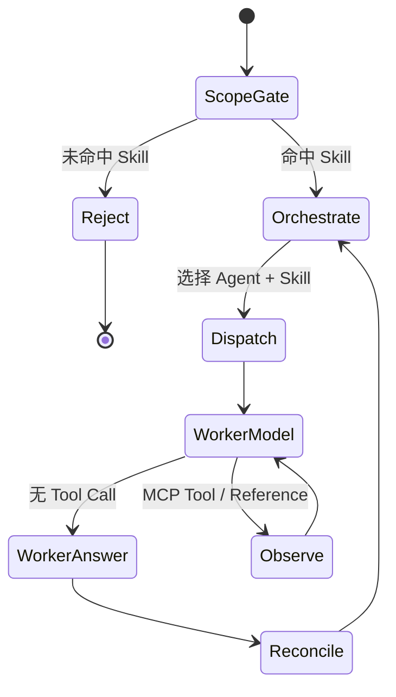

# Nino Data Agent MVP 当前基线

> 当前版本：v0.10  
> 用途：个人面试项目，可执行、可验证、可解释  
> 本文只描述当前仓库和紧邻的下一步，不描述尚未落地的生产平台。

## 1. MVP 已经具备什么

当前 MVP 已经完成从自然语言请求到确定性数据库查询的完整后端链路：

```text
REST/SSE Client
  -> FastAPI Agent API
  -> AgentRuntimeService
  -> 通用 OrchestratorHarness
  -> 动态 Agent + Skill 能力目录
  -> Specialist ReActHarness 或 LangGraphReActHarness
  -> Framework.ToolProvider
  -> McpServerRegistry
  -> McpHttpToolClient -> .NET Nino Data MCP
  -> PostgreSQL demo database
```

已经实现：

- PostgreSQL 17 演示数据库、固定 seed、验证 SQL 和断言。
- .NET 10 MCP Server，默认使用 Stateless Streamable HTTP。
- 三个强类型只读 Tool：订单详情、分组统计、负毛利异常。
- Python 3.12 API-first Agent Runtime。
- 自研轻量 ReAct 与可选 LangGraph ReAct。
- 原生 OpenAI-compatible 模型 Adapter 与可选 LangChain Adapter。
- 一个共享分析 Skill、四个按需加载 Reference。
- 一个业务无关 Orchestrator，以及动态发现的数据 Analyst、Verifier Specialist。
- Conversation、Run、事件历史、SSE 续接、取消和并发限制。
- SQLite 持久化 Conversation、Message、Run、Event 和压缩摘要。
- 同一 `conversation_id` 跨重启继续追问，以及超预算后的动态上下文压缩。
- demo 和 live 两种运行模式。

尚未实现：ACP、Web、认证、OpenTelemetry、远程多实例存储和写操作。

## 2. 面试演示问题

保留三条核心问题：

1. “查询订单 `DEMO-202607-001`，告诉我收入、成本、退款和毛利，并解释订单是否异常。”
2. “统计 2026 年 7 月各产品类型的订单量、销售额、退款额和毛利。”
3. “找出 2026 年 7 月毛利最低的 5 个订单，并分析亏损原因。”

另增加一条多 Agent 演示：

4. “复杂统计 2026 年 7 月毛利并核对结论。”

前三条证明模型能选择 MCP Tool、解释确定性结果；第四条用于展示 Orchestrator 依次委派 Analyst 和 Verifier，以及父子 Run lineage 事件。

## 3. 实际目录

```text
nino-agent/
├── agent/
│   ├── shared/
│   │   ├── contracts/{agent.schema.json,skill.schema.json}
│   │   ├── skills/nino-data-analysis/
│   │   │   ├── skill.json
│   │   │   ├── SKILL.md
│   │   │   └── references/*.md
│   │   └── agents/
│   │       ├── orchestrator/{agent.json,AGENT.md}
│   │       ├── nino-data-analyst/{agent.json,AGENT.md}
│   │       └── nino-data-verifier/{agent.json,AGENT.md}
│   ├── python/
│   │   ├── src/{api,runtime,harness,framework,infrastructure}/
│   │   ├── tests/
│   │   ├── pyproject.toml
│   │   └── Dockerfile
│   ├── nodejs/README.md
│   └── dotnet/README.md
├── mcp/dotnet/
├── database/
│   ├── migrations/
│   ├── seeds/
│   ├── queries/
│   └── tests/
├── doc/
├── nino-agent-storage/             # 本地 SQLite，数据库文件不提交 Git
├── web/                         # 当前为空
├── docker-compose.yml
└── .env.example
```

Node.js 和 .NET Agent Runtime 当前只是语言预留目录，不应在演示中声称已经实现。当前可执行 Agent Runtime 是 Python；当前可执行 .NET 项目是 MCP Server。

## 4. Python Runtime 模块

```text
src/
├── api/
│   ├── schemas.py
│   └── app.py
├── runtime/
│   ├── service.py
│   └── context.py
├── harness/
│   ├── react.py
│   ├── langgraph.py
│   ├── orchestrator.py
│   ├── skills.py
│   ├── agents.py
│   ├── references.py
│   └── documents.py
├── framework/
│   ├── models.py
│   ├── conversation.py
│   ├── ports.py
│   └── repositories.py
├── bootstrap.py
├── demo.py
├── infrastructure/
│   ├── memory.py
│   ├── sqlite.py
│   ├── mcp/{config.py,client.py,registry.py}
│   ├── openai_compatible.py
│   └── langchain_model.py
```

| 层 | 当前实现 |
|---|---|
| Framework | 消息、会话、Run、Tool、`ChatModel`、`ToolProvider`、`AgentHarness` 和 Repository Ports |
| Runtime | Conversation/Run 生命周期、上下文、并发、取消、checkpoint 和事件保存 |
| Harness | 通用编排、动态能力目录、Specialist 轻量/LangGraph ReAct、Reference 和 Tool 过滤 |
| Infrastructure | 模型 Adapter、多 MCP Registry、SQLite Repository |
| Host | FastAPI REST + SSE、CORS、错误映射和 OpenAPI |
| Persistence | `SqliteAgentRepository`，默认写入 `nino-agent-storage/nino-agent.db` |
| Context | `ConversationContextManager`，完整历史或持久化摘要 + 最近消息 |

## 5. ReAct 如何落地



关键点：

- 使用模型原生结构化 tool calling。
- 不要求模型输出或暴露 `Thought:`。
- 主模型只看到能力摘要和 dispatch Tool；Specialist 模型看到 Skill 与 Agent 白名单交集后的 MCP Tools。
- Skill、Agent 和 Runtime 三层步骤预算取最小值。
- 同名 Tool 和同参数不能在一个 Run 内重复调用。
- 默认 Tool 结果最多 50,000 字符。
- MCP、Reference 和 dispatch 的结果都作为 Observation 返回对应循环。

## 6. Agent、Skill、Reference 与 Tool

| 对象 | 当前数量 | 职责 |
|---|---:|---|
| Agent | 3 | 谁执行、谁分析、谁核验 |
| Skill | 1 | 数据分析任务的选择和执行方法 |
| Reference | 4 | 仅在相关步骤加载的详细业务知识 |
| MCP Tool | 3 | 确定性读取和计算数据库结果 |

当前 Agent：

- `nino.orchestrator`：业务无关唯一入口，未命中 Skill 固定拒绝，命中后必须动态派发能力。
- `nino-data.analyst`：执行复杂多步分析，不负责最终核验。
- `nino-data.verifier`：重新核对参数、口径和 Tool 结果，不把 Analyst 文本当作事实。

当前 Skill：`nino-data.analysis`。Analyst 和 Verifier 可复用该 Skill；Orchestrator 不加载业务 Skill。

当前内部 Tools：

- `nino_runtime_load_reference`
- `nino_runtime_dispatch_agent`

它们不是 MCP Tools；前者由 Worker 读取受 Skill 约束的 Reference，后者由控制面选择能力目录中的 Agent + Skill 组合。

## 7. 命名和文件约定

```text
skills/<skill-slug>/{skill.json,SKILL.md,references/}
agents/<agent-slug>/{agent.json,AGENT.md}
```

| 名称 | 示例 | 权威用途 |
|---|---|---|
| JSON `id` | `nino-data.analysis` | 唯一机器 ID、Registry 和 API |
| 目录 slug | `nino-data-analysis` | 文件组织 |
| frontmatter `name` | `nino-data-analysis` | 模型上下文和展示 |

所有 `SKILL.md`、`AGENT.md` 必须有 `name`、`description` frontmatter。Markdown 使用固定文件名，是为了让不同语言的 Loader 采用相同约定；角色名称不需要再次写进文件名。

## 8. MCP 和数据正确性

当前 MCP 默认地址是 `http://127.0.0.1:8091/mcp`，使用标准 MCP Streamable HTTP；`--stdio` 仅作为本地兼容入口。

| Tool | 当前约束 |
|---|---|
| `nino_data_get_order_detail` | 精确订单号，返回五类实体和 totals |
| `nino_data_query_summary` | 半开日期区间；按 `main_product_type`、`channel` 或 `day` 分组 |
| `nino_data_find_anomalies` | 仅 `negative_margin`，limit 1-20 |

指标必须由 MCP/SQL 计算，不能由模型心算：

```text
demo_gross_margin
  = customer_sale_amount
  - net_supplier_cost
  - successful_refund_amount
```

验证分三层：

1. `database/queries/verification.sql` 提供人工可读权威查询。
2. `database/tests/assertions.sql` 对固定 seed 做可执行断言。
3. `Nino.Data.Mcp.Tests` 验证三个 Tool 的查询结果和参数边界。

Agent 评测还应比较：日期范围、分组、币种、指标版本、MCP `QueryId`、数值和限制说明，而不是只判断自然语言看起来是否合理。

## 9. API-first 接入

当前外部接口是 REST + SSE：

| Method | Path |
|---|---|
| `GET` | `/health` |
| `GET` | `/api/v1/skills` |
| `GET` | `/api/v1/agents` |
| `GET` | `/api/v1/mcp/servers` |
| `POST/GET` | `/api/v1/conversations` |
| `GET` | `/api/v1/conversations/{id}/messages` |
| `GET` | `/api/v1/conversations/{id}/context` |
| `GET` | `/api/v1/conversations/{id}/runs` |
| `POST` | `/api/v1/conversations/{id}/messages` |
| `GET` | `/api/v1/runs/{id}` |
| `POST` | `/api/v1/runs/{id}/cancel` |
| `GET` | `/api/v1/runs/{id}/events` |
| `GET` | `/api/v1/runs/{id}/events/stream` |

App、Web、Desktop 当前都可以使用这套接口。ACP 尚未实现，因此不能把 ACP 写成当前前端接入方式。后续 ACP Adapter 应复用 `AgentRuntimeService`，不复制 ReAct Harness。

### 9.1 持久化追问和动态压缩

前端第一次创建会话后必须保存 `conversation_id`，后续追问始终提交到同一 ID。SQLite 会保存消息和答案，因此 API 重启后仍能加载历史。

上下文按 token 预算而不是字符数管理。默认模型窗口为 128K，预留 32K 给 Agent/Skill 指令、Tool Schema、MCP Observation 和最终输出，因此会话历史上限为 96K。首次超过后保留最近 48K token 原文，并把较早消息压缩成最多 12K token 的本地摘要。摘要和截止消息游标存入 `conversation_contexts`；后续优先复用摘要，只有“摘要 + 游标后增量消息”再次超过预算才增量压缩。Run metadata 会记录 `full/compacted`、`compaction_performed` 和 `summary_reused`。实际部署必须配置所选模型的真实窗口。

## 10. 运行模式

### Demo

```text
NINO_RUNTIME_MODE=demo
NINO_AGENT_ENGINE=lightweight
```

使用确定性 Demo Model/Tool，适合验证 API、事件和委派，不会调用真实模型和 MCP。

### Live

```text
NINO_RUNTIME_MODE=live
NINO_AGENT_ENGINE=lightweight
NINO_MODEL_ADAPTER=native
# Runtime 固定使用 gpt-5.4
OPENAI_API_KEY=<secret-from-process-environment>
INCERRY_OPENAI_BASE_URL=http://core.dns-pro.net:13001/v1
NINO_MCP_URL=http://127.0.0.1:8091/mcp
NINO_MCP_SERVERS=
```

可替换为：

- `NINO_AGENT_ENGINE=langgraph`
- `NINO_MODEL_ADAPTER=langchain`

使用 LangChain/LangGraph 前需要安装 `.[frameworks]` optional dependencies。

## 11. 启动

一键启动全部当前服务：

```bash
docker compose up -d --build
docker compose ps
```

本地启动 Python API：

```bash
cd agent/python
python3 -m venv .venv
.venv/bin/pip install -e '.[test]'
.venv/bin/python -m uvicorn api.app:app \
  --host 127.0.0.1 --port 8090 --reload
```

默认地址：

- Agent API：`http://127.0.0.1:8090`
- Swagger：`http://127.0.0.1:8090/docs`
- MCP：`http://127.0.0.1:8091/mcp`
- PostgreSQL：`localhost:55432`

## 12. MVP 验收清单

- [x] 五张匿名化业务表、固定 seed 和只读 MCP 用户。
- [x] 数据库验证 SQL 和断言。
- [x] 三个标准 MCP 只读 Tools。
- [x] Streamable HTTP MCP Client Adapter。
- [x] 原生 OpenAI-compatible 模型 Adapter。
- [x] LangChain 模型 Adapter。
- [x] 轻量 ReAct Runtime。
- [x] LangGraph ReAct Runtime。
- [x] Skill、Reference、Agent Registry。
- [x] 通用 Orchestrator 动态发现 Specialist + Skill 并结构化派发。
- [x] REST/SSE、事件重放和取消。
- [x] SQLite 会话、消息、Run、Event 持久化。
- [x] 跨重启多轮追问。
- [x] 动态上下文压缩与摘要持久化。
- [x] Python Runtime 自动化测试。
- [x] .NET MCP 自动化测试。
- [ ] 真实模型基准答案与 golden SQL 自动对比。
- [ ] ACP Adapter 和 ACP contract tests。
- [ ] 最小 Web 客户端。
- [ ] 远程多实例 Repository（MVP 暂不需要）。

## 13. 下一步只做什么

下一步不应继续扩展基础组件，应该先完成真实模型评测：

1. 用 `live + lightweight + native` 跑通四条演示问题。
2. 保存每次 Tool 参数、MCP `QueryId`、指标版本和最终数字。
3. 与 `verification.sql` 和固定断言逐项比较。
4. 增加至少 10 个 Agent eval cases，包含正常、缺参、非法日期、越权 Tool、Reference 路由和委派。
5. 评测稳定后再实现 ACP Adapter 和 Web。

当前不引入 OpenTelemetry、Redis、队列、对象存储、Kubernetes、长期记忆或自由协作的多 Agent 框架。
