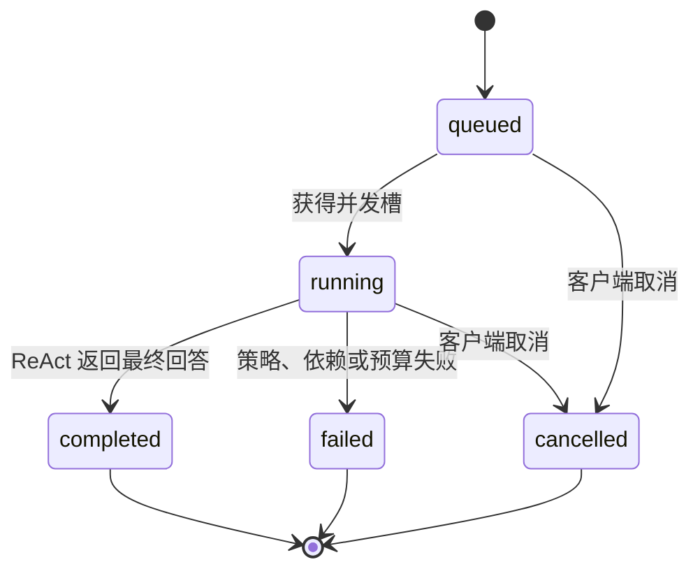

# Python Agent Runtime API v0.13

## 1. 定位

Python Runtime 是 API-first 的 ReAct 执行服务。App、Web、Desktop 通过 REST + SSE 接入；ACP
不在当前产品范围。

当前 Runtime 支持：

- SQLite 持久化 Conversation、Message、Run、Event 和压缩上下文。
- 基于 `conversation_id` 的多轮追问，服务重启后仍可继续。
- 超过模型 token 预算时自动压缩旧历史，保留最近对话。
- 轻量 ReAct 与 LangGraph ReAct。
- 原生 OpenAI-compatible 与 LangChain 模型 Adapter。
- MCP Streamable HTTP Tool Client。
- 通用 Orchestrator 动态发现 Specialist + Skill 能力组合并结构化派发。

## 2. 当前调用链

```text
FastAPI REST + SSE
  -> AgentRuntimeService
     -> SqliteAgentRepository
     -> ConversationContextManager
     -> AgentHarness port
        -> OrchestratorHarness（控制面能力路由与结果汇总）
        -> ReActHarness / LangGraphReActHarness（Specialist Worker）
        -> AgentRegistry / SkillRegistry / Capability Catalog / ReferenceProvider
        -> ChatModel port
        -> ToolProvider port
            -> McpServerRegistry -> one or more MCP servers
```

## 3. 模块边界

| 模块 | 职责 |
|---|---|
| `framework/models.py` | Runtime Message、Tool、Event、Result 类型 |
| `framework/conversation.py` | Conversation、Message、Context、AgentRun 实体 |
| `framework/ports.py` | `ChatModel`、`ToolProvider`、`AgentHarness` Protocol |
| `framework/repositories.py` | 存储无关的 Repository Ports |
| `harness/documents.py` | Markdown YAML frontmatter 解析 |
| `harness/skills.py` | `SkillRegistry`、manifest 加载、能力元数据和底层 fallback 路由 |
| `harness/agents.py` | `AgentRegistry`、角色与委派权限 |
| `harness/orchestrator.py` | 通用主 Agent、动态能力目录、结构化 dispatch 和结果归并 |
| `harness/scheduler.py` | DAG 校验以及 Ready/Blocked Node 的确定性选择 |
| `harness/validation.py` | 持久化 Graph 的依赖、Gate 和 Attempt 一致性检查 |
| `harness/loop.py` | 预算合并、Action/进度记账、停止条件和 checkpoint snapshot |
| `framework/loop.py` | 跨语言 Loop kind/status/stop reason/budget/snapshot 契约 |
| `framework/task_graph.py` | TaskGraph、Node、Gate、Attempt 与 AcceptanceContract 契约 |
| `harness/references.py` | Reference 安全按需加载 |
| `harness/react.py` | Specialist 轻量 ReAct Worker、Tool 策略和预算 |
| `harness/langgraph.py` | 相同 Port 的 LangGraph Harness 实现 |
| `runtime/context.py` | 动态上下文窗口和本地滚动压缩 |
| `runtime/service.py` | 会话、异步 Run、并发、取消和消息回写 |
| `bootstrap.py` | demo/live、模型/Tool Adapter、Harness 组装 |
| `infrastructure/sqlite.py` | 默认 SQLite 持久化实现 |
| `infrastructure/memory.py` | 单元测试和显式注入使用的内存实现 |
| `infrastructure/mcp/config.py` | 多 MCP JSON 配置和校验 |
| `infrastructure/mcp/client.py` | 单个 MCP Streamable HTTP Client |
| `infrastructure/mcp/registry.py` | Tool 聚合、冲突检测、故障隔离和路由 |
| `infrastructure/openai_compatible.py` | 原生模型 Adapter |
| `infrastructure/langchain_model.py` | LangChain 模型 Adapter |
| `api/app.py` | FastAPI、REST、SSE、CORS 和错误映射 |

## 4. 多轮会话

客户端第一次调用 `POST /api/v1/conversations` 获得 `conversation_id`。后续追问必须始终向同一个会话提交：

```text
POST /api/v1/conversations/{conversation_id}/messages
```

AgentRuntimeService 在每次 Run 前从 SQLite 读取该会话之前的 user/assistant 消息，并作为 `history` 传给 Harness。Run 完成后，最终 assistant 回答也写回同一会话。因此“那退款呢”“再按渠道拆一下”这类省略主语的追问可以继承前文。

同一 Conversation 同时只允许一个活动 Run，避免并发追问导致上下文顺序不确定；不同 Conversation 可以并行。

## 5. SQLite 持久化

默认文件：

```text
nino-agent-storage/nino-agent.db
```

Docker 内路径为 `/app/storage/nino-agent.db`，通过 bind mount 映射回项目目录。

表结构：

| 表 | 内容 |
|---|---|
| `conversations` | 会话 ID、标题、创建/更新时间 |
| `messages` | user/assistant 消息、所属会话和 Run |
| `runs` | 状态、Skill、答案、错误、步骤和上下文 metadata |
| `run_events` | 可重放事件，主键为 `run_id + sequence` |
| `conversation_contexts` | 压缩摘要、压缩截止消息和统计信息 |

SQLite 启用 foreign keys、WAL 和 busy timeout。进程启动时，遗留的 `queued/running` Run 会被标记为 `failed/RUNTIME_RESTARTED`，避免永远处于活动状态。

数据库文件、`-wal` 和 `-shm` 文件不提交 Git。

## 6. 动态上下文压缩

默认预算：

| 变量 | 默认值 | 含义 |
|---|---:|---|
| `NINO_MODEL_CONTEXT_TOKENS` | 128000 | 所选模型的总上下文窗口，必须按实际模型配置 |
| `NINO_CONTEXT_RESERVED_TOKENS` | 32000 | Agent/Skill 指令、Tool、Observation 和输出预留 |
| `NINO_CONTEXT_RECENT_TOKENS` | 48000 | 原文保留的最近消息预算 |
| `NINO_CONTEXT_SUMMARY_TOKENS` | 12000 | 较早消息摘要预算 |

执行规则：

1. 历史未超过 `MODEL_CONTEXT_TOKENS - RESERVED_TOKENS`：完整传入所有历史，Run metadata 为 `context.mode=full`。
2. 首次超过阈值：从后向前保留最近消息原文，更早消息生成有界摘要。
3. 摘要连同 `through_message_id` 游标写入 `conversation_contexts`。
4. 后续 Run 使用“持久化摘要 + 游标后的原始消息”，预算内只复用，不重新压缩。
5. 组合上下文再次超过阈值时，只压缩游标后的较旧增量消息，并推进游标。
6. 摘要作为明确标记的普通历史消息注入 Harness，不提升为系统指令。
7. Run metadata 通过 `compaction_performed` 和 `summary_reused` 标识本次行为。

当前压缩是确定性的本地滚动提取式摘要，不额外调用模型，因此成本和行为稳定。压缩仅在历史超过预算时触发，保留近期原文并复用已持久化摘要。默认 `ApproximateTokenCounter` 对中文字符、英文词组和标点做保守估算；它仍是估算值。后续可以注入精确 tokenizer 和模型摘要器，但必须保留当前预算、游标、持久化和测试边界。

查询最近一次持久化压缩状态：

```text
GET /api/v1/conversations/{conversation_id}/context
```

未触发压缩时返回 `null`。

## 7. Run 状态



全局并发数由 `NINO_MAX_CONCURRENT_RUNS` 控制。

## 8. API

| Method | Path | 用途 |
|---|---|---|
| `GET` | `/health` | 服务、Runtime 和模型模式 |
| `GET` | `/api/v1/skills` | 已加载 Skill |
| `GET` | `/api/v1/agents` | primary/specialist Agent |
| `GET` | `/api/v1/mcp/servers` | 多 MCP 状态和按需发现 |
| `POST` | `/api/v1/conversations` | 创建持久化会话 |
| `GET` | `/api/v1/conversations` | 按更新时间列出会话 |
| `GET` | `/api/v1/conversations/{id}` | 读取会话 |
| `GET` | `/api/v1/conversations/{id}/messages` | 读取多轮消息 |
| `GET` | `/api/v1/conversations/{id}/context` | 读取压缩上下文状态 |
| `GET` | `/api/v1/conversations/{id}/runs` | 读取会话 Runs |
| `POST` | `/api/v1/conversations/{id}/messages` | 提交追问，返回 `202 + run_id` |
| `GET` | `/api/v1/runs/{id}` | Run 状态、答案和 context metadata |
| `POST` | `/api/v1/runs/{id}/cancel` | 取消活动 Run |
| `GET` | `/api/v1/runs/{id}/events` | 按 `after` 重放事件 |
| `GET` | `/api/v1/runs/{id}/events/stream` | SSE 事件流 |
| `GET` | `/api/v1/runs/{id}/loop-checkpoint` | 最新 Loop checkpoint，可按 kind 过滤 |

SSE 的 `sequence` 在单个 Run 内严格递增。断线后使用 `after` 或 `Last-Event-ID` 续接。

## 9. 多轮客户端示例

```bash
conversation_id=$(curl -s http://127.0.0.1:8090/api/v1/conversations \
  -H 'Content-Type: application/json' -d '{"title":"July analysis"}' | jq -r .id)

curl -s http://127.0.0.1:8090/api/v1/conversations/$conversation_id/messages \
  -H 'Content-Type: application/json' \
  -d '{"content":"统计 2026 年 7 月各产品类型毛利"}'

# Run 完成后，继续使用同一个 conversation_id
curl -s http://127.0.0.1:8090/api/v1/conversations/$conversation_id/messages \
  -H 'Content-Type: application/json' \
  -d '{"content":"那退款金额呢？"}'
```

前端应持久保存 `conversation_id`，切换会话时加载对应 messages/runs；不要每次追问都创建新会话。

## 10. 配置

| 变量 | 默认值 |
|---|---|
| `NINO_STORAGE_PATH` | `nino-agent-storage/nino-agent.db` |
| `NINO_MAX_CONCURRENT_RUNS` | `4` |
| `NINO_MODEL_CONTEXT_TOKENS` | `128000` |
| `NINO_CONTEXT_RESERVED_TOKENS` | `32000` |
| `NINO_CONTEXT_RECENT_TOKENS` | `48000` |
| `NINO_CONTEXT_SUMMARY_TOKENS` | `12000` |
| `NINO_RUNTIME_MODE` | `demo` |
| `NINO_AGENT_ENGINE` | `lightweight` |
| `NINO_MODEL_ADAPTER` | `native` |
| `NINO_MCP_URL` | `http://127.0.0.1:8091/mcp` |
| `NINO_MCP_SERVERS` | 空；配置后覆盖单 URL fallback |
| `NINO_LOOP_HARD_MAX_STEPS` | `8` |
| `NINO_LOOP_HARD_MAX_ACTIONS` | `32` |
| `NINO_LOOP_HARD_TIMEOUT_SECONDS` | `300` |
| `NINO_LOOP_HARD_MAX_CONSECUTIVE_FAILURES` | `3` |
| `NINO_LOOP_HARD_MAX_NO_PROGRESS_STEPS` | `3` |

## 11. 当前限制

- SQLite 适合本地单实例 MVP，不支持多个 Runtime 容器共享写入。
- 压缩摘要是本地提取式摘要，不保证保留所有早期细节。
- 当前没有删除会话、编辑消息或分支会话 API。
- 当前没有用户身份、租户、加密字段和细粒度权限。
- 客户端统一使用 REST + SSE；当前不计划提供 ACP Host。
- `web/` 尚未实现。
