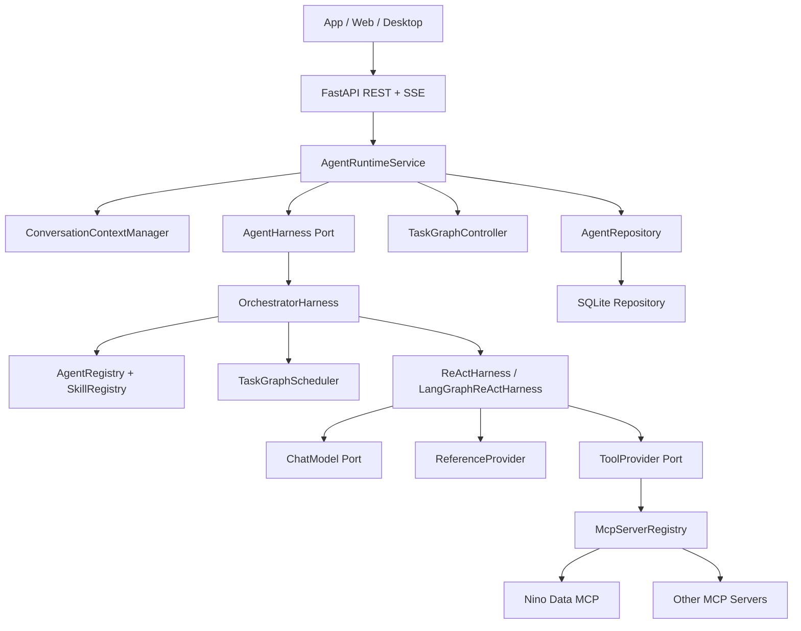
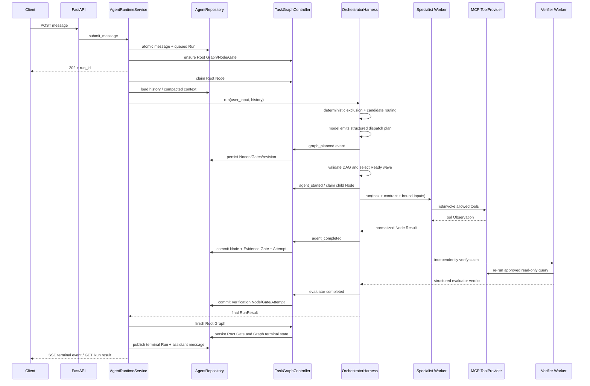

# Nino Agent 任务级 Harness 完整设计

> 适用版本：Nino Agent Runtime v0.13.0
>
> 代码基线：`be4427b feat: 完善企业级数据 Agent Harness 执行内核`
> 文档目标：解释 Nino Agent 为什么这样设计、代码如何实现、哪些能力已经成立，以及当前边界在哪里。

## 1. 一句话定位

Nino Agent 是一个面向只读业务数据分析的 API-first Agent Harness。它不把模型的一次回答当成任务
完成，而是使用持久化 Run、TaskGraph、受控 Specialist、MCP Tool Observation 和独立 Verifier，
把一次用户请求执行成可约束、可观察、可验证、可恢复的任务。

当前最准确的产品表述是：

> Nino Agent 是一个支持持久化任务图、确定性证据门禁、独立验证和故障恢复的只读数据分析 Harness。

它已经能支撑订单查询、指标统计、异常分析和报表解释，但不是一个已经覆盖审批、写操作、身份、
审计、精确节点续跑和分布式调度的完整企业 Agent 平台。

## 2. 为什么不是普通的模型调用封装

普通数据问答通常只有以下流程：

```text
User -> Prompt -> Model -> Answer
```

这种方式无法回答几个关键工程问题：

1. 模型是否调用了真实数据能力，还是直接猜测？
2. 模型是否调用了不属于当前业务能力的 Tool？
3. 一个复杂请求拆成多个步骤后，谁保存任务状态？
4. 一个节点失败后，后续节点是否还会被错误执行？
5. “Agent 已经回答”和“结论已经验证”是否被错误地视为同一件事？
6. API 断线、进程重启或上下文过长后，任务如何继续？
7. 客户端怎样知道 Agent 正在路由、查询、验证，还是已经停止？

Nino Agent 的答案是：把模型放入 Harness，而不是把 Harness 放入 Prompt。

```text
User Request
  -> Durable Run
  -> TaskGraph Control Plane
  -> Orchestrator Route / Plan
  -> Specialist ReAct Worker
  -> MCP Tool Observation
  -> Evidence Gate
  -> Independent Evaluator
  -> Root Completion
```

模型参与语义判断，但不能修改预算、伪造 Tool Observation、绕过能力目录、直接更新 TaskGraph 状态，
也不能把自己的结论直接标记成独立验证通过。

## 3. 设计范围

### 3.1 当前要解决的问题

- 以 REST + SSE 为 App、Web、Desktop 提供统一 Agent Runtime。
- 对订单、支付、退款、收入、成本、毛利、异常和报表类问题执行只读分析。
- 根据动态 Agent + Skill 目录选择合法 Specialist。
- 只向 Worker 暴露 Agent 与 Skill 双重允许的 MCP Tools。
- 要求事实性回答至少存在一次成功的非 Reference Tool Observation。
- 对指定 Skill 的结果执行独立 Verifier 查询与结构化裁决。
- 对复杂请求保存 Node、依赖、Gate、Attempt 和结果。
- 支持不同 Conversation 并发、同一 Conversation 单活动 Run。
- 支持事件重放、取消、上下文压缩和进程重启后的安全恢复。

### 3.2 当前明确不解决的问题

- 业务写操作、退款执行、订单修改等副作用任务。
- 人工审批工作流。代码中存在 `awaiting_approval` 状态，但没有审批 API 和状态推进实现。
- 身份认证、租户隔离、RBAC、行列级数据权限。
- 完整审计与合规留存。
- 跨主机共享队列和远程数据库租约。
- 从模型调用或 Tool 调用中间位置恢复。
- 不重放 Root Orchestrator、直接从任意持久化 Ready Node 继续的精确 Resume。
- 面向 Code Agent 的规划、改代码、Review、Git 和发布工作流。

这些边界是设计选择，不是文档遗漏。当前目标是把只读数据分析做正确，而不是提前实现通用工作流
平台的全部能力。

## 4. 核心设计原则

### 4.1 控制面与任务面分离

Orchestrator 是控制面：只看能力元数据、图状态和子任务摘要。Specialist 是任务面：加载业务 Skill、
Reference 和 MCP Tool。

```text
Control Plane
  - route
  - plan
  - dispatch
  - reconcile
  - complete

Task Plane
  - load business instructions
  - call read-only MCP tools
  - observe deterministic results
  - produce bounded conclusion
```

主 Agent 不直接获得业务 MCP Tool schema，因此不能绕过 Specialist 权限边界查询数据。

### 4.2 TaskGraph 与 ReAct Loop 分离

TaskGraph 描述“任务之间是什么关系”；LoopController 描述“一个节点内部怎样执行”。两者不能合并成
一个无边界状态机。

| 状态层 | 负责内容 | 不负责内容 |
|---|---|---|
| TaskGraph | Node、依赖、Gate、Attempt、恢复和最终完成 | 模型消息、单次 Tool 调用细节 |
| ReAct Loop | model/tool/observation 循环、预算、停止原因 | 跨节点依赖、图级恢复 |
| Run/Event | API 状态、SSE、事件重放 | 业务 Prompt 和 Tool 权限决策 |
| Conversation | 多轮用户语义历史 | 当前 Graph 的执行授权 |

### 4.3 代码状态是真相，Prompt 只提供语义

以下规则由代码执行，而不是依赖模型自觉：

- Agent + Skill 组合必须来自动态 Capability Catalog。
- Tool 必须存在于 Agent 和 Skill allowlist 交集。
- 重复 Action、最大 step、最大 action、超时和连续失败由 LoopController 判断。
- DAG 重复 ID、未知依赖和环由 TaskGraphScheduler 拒绝。
- Node 执行前必须由 Repository 原子 claim。
- 完成 Node 必须有通过的 required Gate。
- Verifier `passed` 必须有真实 Tool evidence。
- TaskGraph 终态先持久化，Run 终态后发布。

### 4.4 证据与结论分离

Specialist 的自然语言不是证据。证据来自成功的 Tool Observation；Verifier 也不能只阅读 Analyst 文本，
必须重新调用批准的只读 Tool。

### 4.5 先保守失败，再允许模型修正

缺少必要参数时使用结构化 clarification；Tool 暂时失败时可以在预算内选择不同 Action；重复调用、
越权调用、证据缺失、图结构非法和 Gate 失败则明确停止或重新规划，不把不确定结果包装成成功。

## 5. 总体架构



### 5.1 代码目录映射

| 目录/文件 | 设计职责 |
|---|---|
| `src/api/app.py` | REST/SSE Host、生命周期启动和 API 映射 |
| `src/runtime/service.py` | Conversation/Run 生命周期、并发、取消、恢复调度、终态发布 |
| `src/runtime/task_graph.py` | Event 到 Graph 的投影、Node claim、Gate 和 Graph 收口 |
| `src/runtime/context.py` | token 预算、历史摘要、上下文编译 |
| `src/framework/ports.py` | AgentHarness、ChatModel、ToolProvider 等稳定 Port |
| `src/framework/task_graph.py` | TaskGraph、TaskNode、TaskGate、NodeAttempt、AcceptanceContract |
| `src/framework/loop.py` | Loop 状态、预算、停止原因的跨实现契约 |
| `src/harness/orchestrator.py` | 路由、Graph revision、调度、结果归并、Evaluator 调度 |
| `src/harness/react.py` | 默认轻量 ReAct Worker |
| `src/harness/langgraph.py` | 同一 Harness Port 的 LangGraph Worker 实现 |
| `src/harness/scheduler.py` | DAG 验证和 Ready/Blocked 计算 |
| `src/harness/validation.py` | 持久化 TaskGraph 一致性 lint |
| `src/harness/agents.py` | Agent 定义、角色和委派权限 |
| `src/harness/skills.py` | Skill、路由元数据、Workflow/Assurance 元数据 |
| `src/harness/references.py` | Reference 白名单和安全文件读取 |
| `src/infrastructure/sqlite.py` | SQLite 表、事务、claim/lease、CAS 和恢复 |
| `src/infrastructure/mcp/registry.py` | 多 MCP 发现、Tool 路由、并发和熔断 |
| `src/bootstrap.py` | 唯一 composition root，选择 Model、Engine、Repository 和 MCP Adapter |

### 5.2 依赖方向

```text
api -> runtime -> framework
harness -> framework
infrastructure -> framework
bootstrap -> all concrete adapters
```

`framework` 不引用 FastAPI、SQLite、httpx、LangChain、LangGraph 或 MCP SDK。Harness 不知道 SQLite
和 HTTP transport；Runtime 不负责 Prompt 和 Tool allowlist；Infrastructure 不决定业务流程。

## 6. 一次请求的完整执行过程



关键顺序是：Graph truth 先完成，Run terminal state 后发布。客户端看到 Run completed 时，持久化
TaskGraph、Node 和 Gate 已经能够解释为什么这个 Run 被认为完成。

## 7. 路由与能力目录

### 7.1 确定性路由第一层

Skill manifest 声明：

- `intent_keywords`：确定性候选召回。
- `excluded_intent_keywords`：当前 Skill 明确不允许处理的意图。
- `routing.semantic_fallback`：关键词未命中时是否允许进入语义候选池。
- `capabilities`：向 Orchestrator 暴露的能力摘要。
- `risk_level`：当前能力风险元数据。

排除规则优先于语义 fallback。当前数据 Skill 明确排除写订单、修改数据库、写代码、新闻和闲聊等
请求。

### 7.2 受控语义路由第二层

关键词未命中时，只有 opt-in Skill 会进入候选。Orchestrator 不能自由回答，只能选择：

1. `nino_runtime_dispatch_agent`：请求确实属于候选能力。
2. `nino_runtime_request_clarification`：缺少范围、日期或分组等关键信息。
3. `nino_runtime_reject_request`：请求不属于候选能力。

这比“所有未命中请求都调用模型自由判断”更保守，也比“所有未命中请求立即拒绝”更能处理企业
同义表达。

### 7.3 Capability Catalog 内容

主模型只看到元数据：

```json
{
  "agent_id": "nino-data.analyst",
  "agent_capabilities": ["data-analysis", "order-query"],
  "skill_id": "nino-data.analysis",
  "skill_capabilities": ["order-query", "grouped-statistics"],
  "risk_level": "read-only",
  "workflow_id": "business-analysis",
  "workflow_execution_shape": "adaptive",
  "assurance_mode": "strict_verify"
}
```

业务 Skill 正文、Reference 内容和 MCP Tool schema 不进入 Orchestrator 主上下文。

## 8. Agent、Skill、Workflow、Reference 和 Tool

| 对象 | 回答的问题 | 当前实现 |
|---|---|---|
| Agent | 谁承担这个节点的职责？ | primary orchestrator、worker analyst、evaluator verifier |
| Skill | Specialist 应如何完成这类业务节点？ | 指令、Tool 白名单、Reference、预算 |
| Workflow metadata | 任务倾向使用什么执行形态？ | `adaptive/single_node/graph`，当前随 Skill 加载 |
| Assurance metadata | 结果需要什么评价？ | `best_effort/strict_verify` + required evaluators |
| Reference | 当前步骤需要加载什么受控知识？ | 指标定义、订单规则、异常规则、报表格式 |
| Tool | 读取哪个确定性外部能力？ | MCP Tool definitions and invocation |

当前没有独立 Workflow Registry/Compiler。Workflow 和 Assurance 已从正文中抽成机器元数据，但它们
仍然随 Skill 加载。对于当前单一数据分析场景，这比提前建设通用 Workflow 平台更合适。

## 9. TaskGraph 领域模型

### 9.1 TaskGraph

TaskGraph 表示一个用户 Run 的宏观任务真相：

```text
TaskGraph
  id / run_id / conversation_id
  user_intent
  status
  version
  parent_graph_id / relation_type
  metadata / timestamps
```

状态：`pending -> running -> completed|failed|cancelled`。Schema 中保留 `awaiting_approval`，但当前
没有审批状态推进实现。

### 9.2 TaskNode

Node 是语义工作边界，而不是每一个 Tool Call：

- `orchestration`：路由、规划和归并。
- `specialist`：一个有独立结果的业务任务。
- `verification/review/critique`：Evaluator 节点。
- `approval`：Schema 预留，当前未执行。

Node 保存 owner、依赖、AcceptanceContract、结构化 Result、错误和时间。

### 9.3 TaskGate

Gate 是节点能否被接受的检查点，不是执行者：

- `acceptance`：Root 完成检查。
- `evidence`：Specialist 是否有成功 Tool Observation。
- `independent_verification`：独立 Verifier 是否给出 proved/pass。
- `review/critique`：可扩展 Evaluator 类型。
- `approval`：Schema 预留，当前未执行。

Gate 状态：`pending/passed/failed/blocked`。

### 9.4 NodeAttempt

Attempt 记录一次节点执行授权：

```text
attempt_number
status: running/completed/failed/cancelled/interrupted
lease_owner / lease_expires_at
checkpoint
error_code
```

恢复不会覆盖旧 Attempt；中断历史被保留，新执行创建递增 Attempt。

### 9.5 AcceptanceContract

合同定义 Gate 通过后节点可以诚实声称什么：

```json
{
  "spec_source": "user_request+registered_skill:nino-data.analysis",
  "target_outcome": "统计 2026 年 7 月毛利",
  "positive_checks": ["结果直接满足委派任务"],
  "negative_checks": ["没有 Tool 证据时不得声称事实"],
  "evidence_requirements": ["至少一次成功业务 Tool Observation"],
  "gaps": [],
  "pass_label": "business_result_verified"
}
```

模型可提供任务专属合同；未提供时 Harness 生成保守默认合同。合同同时传给 Worker、Verifier 和
持久化 TaskNode，避免三处使用不同的完成定义。

## 10. Graph 规划、依赖和并行

### 10.1 Graph revision

Orchestrator 一轮可以产生多个结构化 dispatch。第一次记录 `graph_planned`，后续根据结果追加
`graph_reconciled`。完成历史不删除，新 revision 只增加新的未来节点。

### 10.2 DAG 验证

TaskGraphScheduler 在执行前检查：

- Node ID 格式。
- 同一 revision ID 唯一。
- 依赖必须来自本 revision 或已知历史节点。
- 依赖图不能包含环。

Repository 的 claim 才是最终执行授权。Scheduler 的 Ready 结果是调度决策，不代替数据库事务。

### 10.3 波次执行

没有未满足依赖的 Node 进入 Ready wave；互不依赖的 Node 使用 `asyncio.gather` 并行，但仍受
`NINO_GRAPH_MAX_PARALLEL_NODES` 限制。上游失败后，下游标记为 skipped，Gate 标记 blocked。

### 10.4 控制依赖与数据依赖

`depends_on` 只表达控制关系。`input_bindings` 表达下游需要消费的上游字段：

```json
{
  "name": "upstream_metrics",
  "source_node_id": "summary-query",
  "selector": "outputs"
}
```

允许 selector：`summary/outputs/findings/evidence/concerns/recommended_next`。Binding source 必须同时
出现在 `depends_on`。没有显式 binding 时，Harness 默认传递依赖节点 summary。

这样下游得到的是裁剪后的结构化输入，而不是父 Agent 的完整上下文、隐藏推理或原始 Tool dump。

## 11. Specialist Worker ReAct

### 11.1 Worker 输入

Worker fresh context 由以下部分组成：

```text
Agent instructions
Skill instructions
Strict worker policy
Delegated task
Acceptance contract
Node result contract
Bound upstream inputs
Approved references (on demand)
```

### 11.2 Tool 目录

Worker 可见 Tool 集合：

```text
global MCP catalog
  intersect Skill.allowed_tools
  intersect Agent.allowed_tools
  plus allowed internal Actions
```

缺失任何必需 Tool 时，Worker 在模型调用前失败，不能静默降级成自由回答。

### 11.3 内部 Actions

- `nino_runtime_load_reference`：按 ID 加载 Skill Reference。
- `nino_runtime_request_clarification`：提交不超过 500 字符的缺参问题。
- `nino_runtime_submit_evaluator_verdict`：Evaluator 结构化终态。
- `nino_runtime_delegate_agent`：只在 Agent 定义允许且深度预算未超限时出现。

### 11.4 Evidence Gate

事实性回答必须至少有一次成功、非 Reference、非内部 Action 的 Tool Observation。否则返回
`EVIDENCE_REQUIRED`。这阻止模型在数据 Tool 没有执行时凭训练知识生成看似合理的业务数字。

### 11.5 Node Result 归一化

推荐 Worker 返回：

```json
{
  "status": "completed",
  "summary": "结论摘要",
  "outputs": {"currency": "CNY", "margin": 60},
  "findings": ["毛利为正"],
  "concerns": [],
  "recommended_next": []
}
```

Harness 另外记录 Tool evidence、error_code 和 retryable。为兼容现有模型，纯文本结果仍会被归一化成
最小结构化 Result；当前没有强制 Worker 必须调用独立的 submit-node-result Action。

## 12. Loop Engineering

### 12.1 预算合并

Worker 使用 Runtime、Agent、Skill 三层中最严格的预算：

```text
max steps
max actions
timeout
max consecutive failures
max no-progress steps
```

模型不能扩大预算。

### 12.2 Action 与 Observation

```text
begin_step
  -> timeout / max-step check
  -> model decision
  -> validate tool call
  -> register_action(signature)
  -> invoke tool
  -> record_observation(success/failure)
  -> continue or stop
```

Action signature 使用规范化参数计算 hash。重复签名被拒绝，checkpoint 不保存完整参数和秘密。

### 12.3 Checkpoint

产生阶段：

- `before_model`
- `after_observation`
- `terminal`

Checkpoint 用于进度、诊断和事件重放。它不是模型中间态 Resume：不保存隐藏 chain-of-thought、完整
Tool 参数、API Key 或可重建的全部协议消息。

## 13. 独立验证与 Gate

Skill 通过 `assurance.required_evaluators` 声明需要哪些评价角色。当前数据分析 Skill 使用：

```json
{
  "assurance": {
    "mode": "strict_verify",
    "required_evaluators": ["verification"]
  }
}
```

Verifier 的约束：

1. 使用 fresh context。
2. 接收原任务、AcceptanceContract 和 Analyst claim。
3. 不把 Analyst 文本当作事实。
4. 重新调用最小必要只读 Tool。
5. 通过 `nino_runtime_submit_evaluator_verdict` 返回结构化 verdict。
6. 只有 `verdict=passed`、`evidence_level=proved` 且存在 Tool evidence 才通过。

Evaluator verdict：

```json
{
  "verdict": "passed",
  "evidence_level": "proved",
  "checked_requirements": ["订单号和金额与 Tool 结果一致"],
  "failed_requirements": [],
  "concerns": []
}
```

需要准确理解“确定性 Gate”的边界：Gate 的状态转换和证据存在性是确定性的；业务语义是否真正正确
仍取决于 Tool 的确定性、AcceptanceContract 的质量和 Verifier 的判断。当前不是形式化证明系统。

## 14. 持久化和一致性

### 14.1 SQLite 表

```text
conversations
messages
runs
run_events
run_event_counters
runtime_instances
conversation_contexts
task_graphs
task_nodes
task_gates
node_attempts
```

### 14.2 关键事务保证

- user message 与 queued Run 原子创建。
- 数据库唯一索引限制同一 Conversation 只能有一个 queued/running Run。
- Event sequence 使用 `BEGIN IMMEDIATE` 原子分配。
- Node claim 使用事务检查 Node 状态、依赖和 required Gate，然后创建 Attempt。
- Node、Gate、Attempt 在一个事务中收口。
- TaskGraph 使用 version compare-and-swap，冲突返回 `GRAPH_VERSION_CONFLICT`。
- Graph/Gate 终态先写入，Run completed 后发布。

### 14.3 为什么 Event 和 Graph 都存在

Event 是发生过什么的时间序列；Graph 是当前任务控制状态。`graph_planned`、`agent_started`、
`tool_completed` 和 `agent_completed` 事件由 TaskGraphController 投影为 Node、Gate 和 Attempt 变更。

两者用途不同：

- Event 支持 SSE、断线重放和诊断。
- Graph 支持调度、恢复、Gate 判断和 API 查询。

## 15. 恢复语义

### 15.1 当前已经实现的恢复

Runtime 启动时：

1. 注册 `runtime_instance` 并开始心跳。
2. 查找 lease owner 已失效或 lease 已过期的 running Attempt。
3. 将旧 Attempt 标记为 `interrupted/RUNTIME_RESTARTED`。
4. 将对应 Node、Graph 和 Run 返回 pending/queued。
5. 读取原始 trigger message 和 Conversation history。
6. 重新运行 Root Orchestrator。
7. 当模型生成相同稳定 Node ID 时，直接复用已完成 Node Result，不再次运行 Worker。
8. 未完成 Node 创建递增 Attempt 后重新执行。

这是一种适合当前只读任务的 at-least-once Root replay + completed-node reuse。

### 15.2 当前没有实现的精确 Resume

- 不直接从持久化 Graph 的任意 Ready Node 开始。
- 不恢复某次模型调用中间状态。
- 不恢复某次 Tool 调用中间状态。
- 不保证模型重放时生成完全相同的未来 Graph revision。
- 不支持有副作用 Tool 的幂等恢复。

因此对外应该说“支持只读任务的安全恢复”，不应该说“支持任意节点的精确 Resume”。

## 16. Conversation 与上下文

原始 Conversation messages 是权威历史；`conversation_contexts` 是可以重建的派生摘要。

```text
history tokens <= budget
  -> full history

history tokens > budget
  -> keep recent messages verbatim
  -> extractively summarize older messages
  -> persist summary + through_message_id

next run
  -> reuse summary + messages after cursor
  -> compact new delta only when composed context overflows again
```

摘要作为带明确标记的普通历史消息注入，不提升为系统指令，降低历史内容成为新指令的风险。

当前是确定性提取式压缩，不额外调用模型；优点是成本和行为稳定，缺点是语义压缩能力有限。

## 17. 多 MCP 设计

McpServerRegistry 把多个 MCP Server 聚合成一个 ToolProvider：

1. 并行发现各 Server Tool。
2. 建立 `tool_name -> server_id` 路由。
3. 全局 Tool 名称冲突时拒绝目录。
4. required Server 失败时阻断发现。
5. optional Server 失败时隔离该 Server。
6. 每个 Server 使用独立 semaphore 限制并发。
7. 连续调用失败达到阈值后打开熔断器。

Registry 只解决 transport 和可用性，不承担业务授权；Agent/Skill Tool allowlist 仍在 Harness 中执行。

## 18. API 和事件模型

### 18.1 产品协议

当前产品入口是 REST + SSE，不是 CLI，也不是 ACP。

主要资源：

- Conversation
- Message
- Run
- Event
- Context snapshot
- TaskGraph / Node / Gate / Attempt
- Skill / Agent / MCP status

### 18.2 Run 状态

```text
queued -> running -> completed|failed|cancelled
```

同一 Conversation 同时只有一个 active Run；不同 Conversation 共享 Runtime 全局并发配额。

### 18.3 关键事件

```text
run_started
graph_planned / graph_reconciled
loop_checkpoint
skill_selected
model_started / model_completed
reference_loaded
tool_started / tool_completed
agent_started / agent_completed / agent_failed
clarification_requested
policy_rejected
node_skipped
run_completed / run_failed / run_cancelled / run_interrupted
```

客户端可使用 `after` 或 SSE `Last-Event-ID` 续接事件，不需要从零重放。

## 19. TaskGraph Lint

`lint_task_graph` 检查持久化状态，而不是只检查模型计划：

- 依赖是否指向存在 Node。
- 每个 Node 是否有 required Gate。
- completed Node 的 required Gate 是否全部 passed。
- running Node 是否恰有一个 running Attempt。
- 非 running Node 是否错误保留 running Attempt。
- 持久化依赖图是否存在环。

API：`GET /api/v1/runs/{run_id}/task-graph/lint`。

## 20. 扩展一个新业务能力

以新增“客户经营分析”为例：

1. 新增 MCP Server 或在现有 Server 增加确定性只读 Tool。
2. 在 `agent/shared/skills/<skill>/skill.json` 声明 ID、capabilities、routing、Tool、Reference、预算和 assurance。
3. 编写同目录 `SKILL.md`，描述执行规则，不写 transport 细节。
4. 新增或复用 Specialist Agent，把 `allowed_skills` 和 `allowed_tools` 指向新能力。
5. 如需独立验证，为对应 evaluator Agent 授权相同 Skill 和最小 Tool 集。
6. 在 `NINO_MCP_SERVERS` 注册 Server。
7. 增加 routing、越权拒绝、正常 Tool、缺参澄清、Evaluator 和 API 事件测试。
8. 增加 Skill question bank 和 live benchmark case。

Orchestrator 不应追加具体业务名称；Capability Catalog 会在 Runtime 重启后动态包含新组合。

## 21. 测试策略和证据

当前 Python 测试共 62 项，覆盖层次如下：

| 测试文件 | 主要证明 |
|---|---|
| `test_layered_architecture.py` | 依赖方向、Port 边界和 step 契约 |
| `test_react_harness.py` | Tool allowlist、证据门禁、澄清、重复调用和预算 |
| `test_langgraph_harness.py` | LangGraph 与相同 Harness Port 的 model-tool-model 流程 |
| `test_orchestrator.py` | 路由、dispatch、DAG、并行、binding、reconcile、Verifier 和节点复用 |
| `test_task_graph_scheduler.py` | 未知依赖、环、Ready/Blocked 计算 |
| `test_task_graph.py` | API Graph、Gate、Attempt、CAS、claim、shutdown/restart 恢复 |
| `test_persistence_context.py` | 多轮历史、摘要持久化和增量复用 |
| `test_mcp_registry.py` | 多 Server、冲突、optional/required 隔离、熔断 |
| `test_adapters.py` | OpenAI-compatible Tool Calling 和 MCP HTTP Adapter |
| `test_api.py` | REST/SSE、取消、TaskGraph 和终态 |
| `test_evaluation_suite.py` | Skill 标准题库契约 |

标准命令：

```bash
cd agent/python
PYTHONPATH=src .venv/bin/python -m unittest discover -s tests -v
```

固定标准题库位于 `agent/shared/question-banks/<capability>/`，由所有语言 Runtime 共享。测试运行时
不得临时生成题目；Skill、Tool、指标口径或种子真值变化时，人工更新预期并提升题库版本。Live
benchmark 位于 `agent/python/evals/live_benchmark.py`，用于真实模型和 MCP 链路；单元测试通过不
等于真实模型路由、参数和解释质量已经达到生产要求。

## 22. Git 演进历史

### 22.1 `4fd8492`：仓库占位

- 时间：2026-07-17 11:37 +08:00。
- 内容：临时占位文件。
- 设计意义：无。后续初始化提交删除该占位文件。

### 22.2 `ee55b76 feature： 初始化项目`

这是第一版完整系统基线，建立了：

- FastAPI REST + SSE Runtime。
- Framework/Harness/Runtime/Infrastructure 分层。
- lightweight 和 LangGraph 两种 Worker。
- Orchestrator、Analyst、Verifier Agent 定义。
- Skill、Reference、Agent JSON/Markdown 共享契约。
- 多 MCP Registry、OpenAI-compatible 和 LangChain Adapter。
- SQLite Conversation/Run/Event/Context。
- LoopController、Tool evidence 和基础委派。
- .NET 数据 MCP、PostgreSQL schema、种子和验证 SQL。
- Docker Compose 和初始设计文档。

这一阶段解决的是“Agent 怎样运行”和“业务数据怎样通过 MCP 暴露”。

### 22.3 `9e67f80 feat: 强化技能编排并新增实时评测套件`

这一阶段把“能调用工具”提高到“受控地调用正确工具”：

- 严格 Skill 路由、委派和 Tool evidence 策略。
- 缺参必须使用结构化 clarification。
- 固定 GPT-5.4 live 配置和 Tool Calling 接入。
- 新增标准 question bank、evaluation suite 和 live benchmark。
- 扩展 MCP 汇总 totals 与相关测试。

这一阶段解决的是“怎样证明 Agent 没有绕过 Skill 和证据要求”。

### 22.4 `be4427b feat: 完善企业级数据 Agent Harness 执行内核`

这一阶段把单 Run Loop 提升为任务级 Harness：

- TaskGraph、TaskNode、TaskGate、NodeAttempt 持久化模型。
- DAG 验证、Ready wave、并行 Node 和依赖失败阻断。
- AcceptanceContract、Node Result、Evaluator Verdict 和 Graph schema。
- 独立 Verifier Gate，不再把 Analyst 自述当验收。
- Node claim/lease、Graph CAS、原子 Event sequence。
- Runtime heartbeat、interrupted Attempt 和 Root replay 恢复。
- 受控语义 fallback、顶层 clarification/rejection。
- `input_bindings` 和上游结构化结果传递。
- 多 MCP 并发与熔断、TaskGraph API 和 lint。
- 62 项 Python 回归测试通过。

这一阶段解决的是“怎样让一个复杂业务请求成为可保存、可调度、可验证和可恢复的任务”。

## 23. 与 Code Agent Harness 的区别

Nino Agent 不复制 Code Agent Harness 的完整工程团队模型。

| 维度 | Nino Agent | Code Agent Harness |
|---|---|---|
| 任务对象 | 数据查询、统计、异常和报表解释 | 规划、设计、编码、Review、测试、Git |
| Worker 核心 | ReAct + read-only MCP | 宿主代码 Agent 和文件/终端能力 |
| 证据 | 确定性数据 Tool Observation | diff、build、test、review evidence |
| 任务图 | 业务分析 Node 和 Verifier | 多阶段工程角色和交付 Gate |
| 当前重点 | 数据准确、口径、权限边界、恢复 | 多角色交接、提交质量、工程完成保证 |

因此当前不继续建设独立 Workflow Registry、Artifact Store、复杂 Reviewer/Critic 拓扑和通用工作流
编译器。已有 TaskGraph 是为了支持数据分析中的批量、依赖、验证和恢复，而不是把 Nino 变成 Code
Agent。

## 24. 已实现、部分实现和尚未实现

| 能力 | 状态 | 准确说明 |
|---|---|---|
| ReAct + MCP | 已实现 | lightweight/LangGraph，Tool allowlist 和 evidence gate |
| 多轮会话 | 已实现 | SQLite 原始消息 + 派生摘要 |
| TaskGraph | 已实现 | Node/Gate/Attempt、依赖、并行、revision |
| 确定性 Evidence Gate | 已实现 | 成功 Tool Observation 是硬条件 |
| 独立 Verifier | 已实现 | proved/pass + Tool evidence |
| AcceptanceContract | 已实现 | 节点合同贯穿 Worker、Verifier 和持久化 |
| 结构化 Node Result | 部分实现 | 支持并归一化，但未强制 submit Action |
| Workflow/Assurance | 部分实现 | manifest 元数据已存在，无独立 Registry/Compiler |
| 恢复 | 部分实现 | Root replay + completed-node reuse，仅适合只读任务 |
| 精确 Resume | 未实现 | 不能直接从任意 Ready Node 或中间 Tool 状态继续 |
| 审批 | 未实现 | 只有状态/schema 预留，没有 API 和推进逻辑 |
| 写操作安全 | 未实现 | 无 approval、idempotency key、Action ledger、compensation |
| 身份和租户 | 未实现 | 无 Auth/RBAC/row-level permission |
| 分布式 Runtime | 未实现 | SQLite lease 只适用于共享本地文件场景 |

## 25. 设计取舍

### 25.1 为什么默认 lightweight，而不是所有流程都用 LangGraph

核心契约是 AgentHarness Port 和 LoopController，不是某个框架。lightweight 依赖少、行为透明、便于
测试；LangGraph 作为可选 Worker Engine 验证框架可替换性。宏观 TaskGraph 是 Nino 自己的持久化业务
模型，不应与 LangGraph 内部 model/tool graph 混为一谈。

### 25.2 为什么使用 SQLite

当前目标是单机可运行、状态真实、测试快速。SQLite 足以验证事务、CAS、claim、lease 和恢复语义。
远程共享数据库是部署演进，不应在核心语义尚未稳定时成为前置条件。

### 25.3 为什么 Verifier 默认独立查询

Analyst 的文本可能遗漏条件或解释错误。Verifier 重查最小必要数据，才能让“验证”具有独立性。代价是
增加模型和 Tool 调用，因此后续可按 Skill 风险调整 assurance，但当前财务数据演示选择严格验证。

### 25.4 为什么保留自由文本 Node Result 兼容

强制结构化 Action 能提高确定性，但会增加模型适配和 Prompt 复杂度。当前先通过 Harness 归一化建立
稳定下游契约，再根据真实 Eval 决定是否强制 submit-node-result，避免提前增加无验证收益的机制。

### 25.5 为什么恢复只承诺只读安全

Root replay 可能再次规划未完成节点。只读查询重复执行通常安全；写操作可能重复创建订单或退款。
没有幂等 Action ledger 之前，开放写 Tool 会使恢复语义不可信，因此当前明确限制为 read-only。

## 26. 如何向别人解释这套思路

可以使用以下四句话：

1. **模型负责判断，Harness 负责约束。** 模型选择能力和 Action，但权限、预算、状态和完成条件由代码控制。
2. **Tool Observation 才是数据证据。** Agent 没有成功查询数据就不能生成事实性结论。
3. **Agent 完成不等于任务完成。** Analyst 结果还要经过独立 Verifier 和持久化 Gate。
4. **恢复的是任务，不是隐藏思维。** 系统保存 Graph、Node、Gate、Attempt 和结果，通过 Root replay 与稳定节点复用恢复，只读范围内安全。

更完整的介绍：

> Nino Agent 把一次数据问题建模成持久化 Run 和 TaskGraph。通用 Orchestrator 只读取动态能力目录，
> 将任务派发给 fresh-context Specialist；Specialist 只能调用 Agent 与 Skill 双重批准的 MCP Tool，
> 并且必须取得成功 Observation 才能回答。需要严格保证的 Skill 会自动创建独立 Verifier 节点，
> Verifier 重新查询数据并提交结构化 verdict。所有 Node、Gate、Attempt 和事件都被持久化，进程中断后
> 可以重放 Root 并复用已完成节点。这样系统既保留模型的语义能力，又把权限、证据、执行状态和完成
> 条件掌握在 Harness 中。

## 27. 相关文档

- `README.md`：多语言项目定位、当前实现矩阵和快速入口。
- `agent/python/README.md`：运行、API 和配置入口。
- `doc/gpt-5.4-agent-runbook.md`：真实模型联调与验收。

本文件是当前唯一的总体设计文档。历史计划和分散的专题设计已删除；后续架构变化应直接更新本文，
避免多个文档分别描述同一执行语义。
